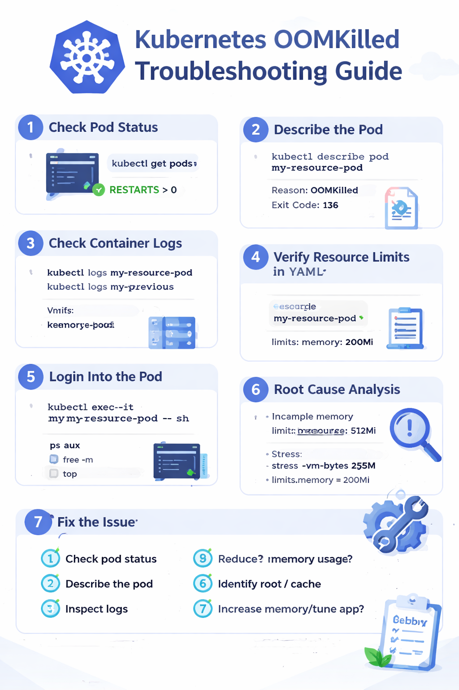
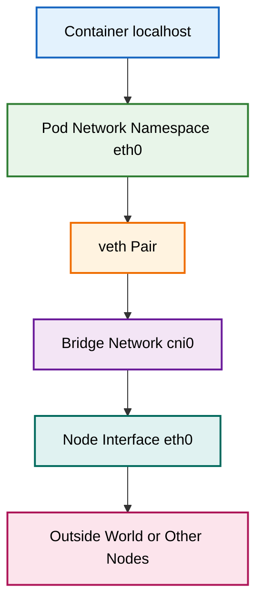
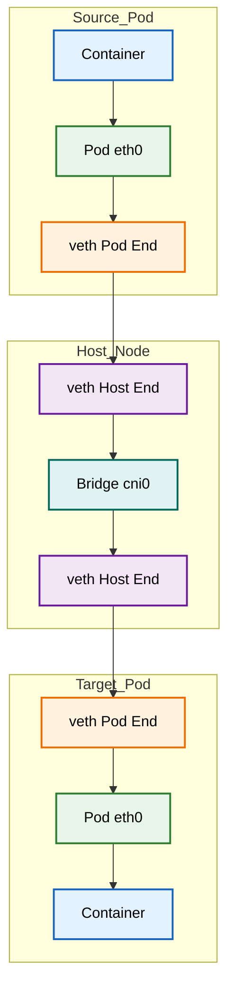
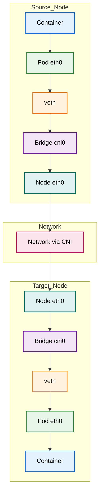

# 📦 Container Tools & Kubernetes Overview

## 📑 Table of Contents

- [📦 Container Tools \& Kubernetes Overview](#-container-tools--kubernetes-overview)
  - [📑 Table of Contents](#-table-of-contents)
  - [🐳 Container Tools](#-container-tools)
  - [☸️ Kubernetes Overview](#️-kubernetes-overview)
    - [Key Features:](#key-features)
  - [⚙️ Containerization vs Orchestration](#️-containerization-vs-orchestration)
  - [🏗️ Kubernetes Cluster Architecture](#️-kubernetes-cluster-architecture)
  - [🔀 Types of Kubernetes Clusters](#-types-of-kubernetes-clusters)
    - [1️⃣ Single Node Cluster](#1️⃣-single-node-cluster)
      - [Used For:](#used-for)
      - [Examples:](#examples)
    - [2️⃣ Multi Node Cluster](#2️⃣-multi-node-cluster)
      - [Used In:](#used-in)
      - [Provides:](#provides)
  - [🖥️ Self-Hosted Kubernetes Cluster](#️-self-hosted-kubernetes-cluster)
      - [Tools:](#tools)
  - [☁️ Cloud Hosted Kubernetes Services](#️-cloud-hosted-kubernetes-services)
  - [✅ Summary](#-summary)
- [☸️ Kubernetes Architecture (K8s)](#️-kubernetes-architecture-k8s)
  - [📌 Overview](#-overview)
  - [🧠 Control Plane Components](#-control-plane-components)
    - [1️⃣ Kube API Server](#1️⃣-kube-api-server)
    - [2️⃣ etcd](#2️⃣-etcd)
    - [3️⃣ Kube Scheduler](#3️⃣-kube-scheduler)
    - [4️⃣ Kube Controller Manager](#4️⃣-kube-controller-manager)
      - [What is Desired State?](#what-is-desired-state)
  - [🔁 Controller Manager \& Controllers](#-controller-manager--controllers)
    - [1. Node Controller](#1-node-controller)
    - [2. Replication Controller / ReplicaSet](#2-replication-controller--replicaset)
    - [3. Endpoint Controller](#3-endpoint-controller)
    - [4. Service Account Controller](#4-service-account-controller)
  - [🖥️ Worker Node Components in Kubernetes](#️-worker-node-components-in-kubernetes)
    - [1️⃣ Kubelet](#1️⃣-kubelet)
    - [2️⃣ Kube-Proxy](#2️⃣-kube-proxy)
    - [3️⃣ Container Runtime](#3️⃣-container-runtime)
  - [🎯 Key Interview Points](#-key-interview-points)
  - [✅ Summary](#-summary-1)
- [🚀 Kubernetes Pod Creation \& Networking Flow](#-kubernetes-pod-creation--networking-flow)
  - [📌 Control Plane Flow](#-control-plane-flow)
    - [Step 1: Request to API Server](#step-1-request-to-api-server)
    - [Step 2: Validation \& Persistence](#step-2-validation--persistence)
    - [Step 3: Controller Manager Reaction](#step-3-controller-manager-reaction)
    - [Step 4: Scheduler Watches for Unscheduled Pods](#step-4-scheduler-watches-for-unscheduled-pods)
    - [Step 5: Scheduler Updates API Server](#step-5-scheduler-updates-api-server)
  - [🖥️ Worker Node Flow](#️-worker-node-flow)
    - [Step 6: Kubelet Watches API Server](#step-6-kubelet-watches-api-server)
    - [Step 7: Kubelet → Container Runtime (CRI)](#step-7-kubelet--container-runtime-cri)
    - [Step 8: Container Runtime Responsibilities](#step-8-container-runtime-responsibilities)
    - [Step 9: Networking Setup via CNI](#step-9-networking-setup-via-cni)
    - [Step 10: Kubelet Ensures Desired State](#step-10-kubelet-ensures-desired-state)
    - [Step 11: kube-proxy Handles Service Networking](#step-11-kube-proxy-handles-service-networking)
  - [🔄 Summary Flow](#-summary-flow)
  - [📊 Kubernetes Pod Creation \& Networking Flow](#-kubernetes-pod-creation--networking-flow-1)
  - [🔄 Kubernetes Pod Creation \& Networking Flow (Step-by-Step)](#-kubernetes-pod-creation--networking-flow-step-by-step)
    - [🚀 Step-by-Step Flow](#-step-by-step-flow)
    - [🖥️ Worker Node Execution](#️-worker-node-execution)
    - [🌐 Networking Setup](#-networking-setup)
    - [🔁 Monitoring \& Service Networking](#-monitoring--service-networking)
  - [🔗 Control Plane Communication](#-control-plane-communication)
    - [🔹 1️⃣ kubectl (CLI)](#-1️⃣-kubectl-cli)
    - [🔹 2️⃣ API (REST / YAML / JSON)](#-2️⃣-api-rest--yaml--json)
  - [🐳 Docker vs ☸️ Kubernetes](#-docker-vs-️-kubernetes)
  - [📦 Pod Concept](#-pod-concept)
  - [🚀 Pod Creation Methods](#-pod-creation-methods)
    - [1️⃣ Imperative Way (CLI)](#1️⃣-imperative-way-cli)
      - [Commands:](#commands)
    - [2️⃣ Declarative Way (YAML)](#2️⃣-declarative-way-yaml)
  - [📝 YAML Basics](#-yaml-basics)
    - [🔹 Simple Data Types](#-simple-data-types)
      - [Text](#text)
      - [Number](#number)
      - [Boolean](#boolean)
    - [🔹 Complex Data Types](#-complex-data-types)
      - [List / Array](#list--array)
      - [Object / Map](#object--map)
  - [🔢 Kubernetes API Versions](#-kubernetes-api-versions)
    - [1️⃣ Alpha Version](#1️⃣-alpha-version)
    - [2️⃣ Beta Version](#2️⃣-beta-version)
    - [3️⃣ Stable Version (GA)](#3️⃣-stable-version-ga)
  - [✅ Summary](#-summary-2)
  - [🔍 API Resources Command](#-api-resources-command)
    - [💡 What it shows:](#-what-it-shows)
  - [📄 Basic Kubernetes Manifest (YAML)](#-basic-kubernetes-manifest-yaml)
    - [🔑 Explanation:](#-explanation)
  - [✅ Quick Note](#-quick-note)
  - [📄 Kubernetes Manifest File Structure](#-kubernetes-manifest-file-structure)
    - [🧩 Basic Structure](#-basic-structure)
  - [🔑 Field Explanation](#-field-explanation)
    - [1️⃣ apiVersion](#1️⃣-apiversion)
    - [2️⃣ kind](#2️⃣-kind)
    - [3️⃣ metadata](#3️⃣-metadata)
    - [4️⃣ spec](#4️⃣-spec)
    - [5️⃣ status (Auto-generated)](#5️⃣-status-auto-generated)
  - [📌 Example](#-example)
  - [✅ Summary](#-summary-3)
- [☸️ Kubernetes Cluster Setup (3 Nodes using kubeadm)](#️-kubernetes-cluster-setup-3-nodes-using-kubeadm)
  - [📌 Overview](#-overview-1)
  - [⚙️ Prerequisites](#️-prerequisites)
  - [🚀 Step 1: Create Instances](#-step-1-create-instances)
  - [🔄 Step 2: Initial Setup (All Nodes)](#-step-2-initial-setup-all-nodes)
  - [📦 Step 3: Install Container Runtime (All Nodes)](#-step-3-install-container-runtime-all-nodes)
    - [Install Docker](#install-docker)
    - [Install CRI-Dockerd](#install-cri-dockerd)
    - [Install Additional Packages](#install-additional-packages)
    - [Configure containerd](#configure-containerd)
  - [☸️ Step 4: Install Kubernetes Components (All Nodes)](#️-step-4-install-kubernetes-components-all-nodes)
  - [🧠 Step 5: Initialize Master Node](#-step-5-initialize-master-node)
    - [Configure kubectl (Master Node)](#configure-kubectl-master-node)
  - [🔗 Step 6: Join Worker Nodes](#-step-6-join-worker-nodes)
  - [🌐 Step 7: Install CNI Plugin (Master Node)](#-step-7-install-cni-plugin-master-node)
    - [Flannel](#flannel)
    - [Weave](#weave)
  - [✅ Step 8: Verify Cluster](#-step-8-verify-cluster)
  - [🚀 Step 9: Deploy Sample Pod](#-step-9-deploy-sample-pod)
    - [Create YAML File](#create-yaml-file)
    - [Apply Pod](#apply-pod)
    - [Check Pods](#check-pods)
  - [🎯 Final Result](#-final-result)
- [⚙️ Kubernetes Pod Commands (kubectl)](#️-kubernetes-pod-commands-kubectl)
  - [🚀 Create Pod](#-create-pod)
  - [📄 Get Pod Information](#-get-pod-information)
  - [🔄 Watch Pod Status (Real-Time)](#-watch-pod-status-real-time)
  - [❌ Delete Pod](#-delete-pod)
  - [🔁 Replace Pod (Force)](#-replace-pod-force)
  - [🖥️ Login into Pod (Exec)](#️-login-into-pod-exec)
  - [🔍 Describe Pod (Detailed Info)](#-describe-pod-detailed-info)
  - [🧾 Get Pod YAML Configuration](#-get-pod-yaml-configuration)
- [Main Containers in Kubernetes](#main-containers-in-kubernetes)
  - [Key Points](#key-points)
  - [Running Application Inside a Pod](#running-application-inside-a-pod)
    - [Example](#example)
  - [Single Container Pod Example (Nginx)](#single-container-pod-example-nginx)
  - [Alpine Container Behavior](#alpine-container-behavior)
  - [Kubernetes Pod with Command \& Args](#kubernetes-pod-with-command--args)
  - [Summary](#summary)
- [Init Containers in Kubernetes](#init-containers-in-kubernetes)
  - [Key Points](#key-points-1)
  - [Why Use Init Containers?](#why-use-init-containers)
    - [Example Use Case](#example-use-case)
  - [Example: Init Container with Shared Volume](#example-init-container-with-shared-volume)
  - [Summary](#summary-1)
- [Sidecar Containers in Kubernetes](#sidecar-containers-in-kubernetes)
  - [Key Points](#key-points-2)
  - [Why Use Sidecar Containers?](#why-use-sidecar-containers)
    - [Common Use Cases](#common-use-cases)
  - [Example: Sidecar for Log Monitoring](#example-sidecar-for-log-monitoring)
  - [Summary](#summary-2)
- [Ambassador Containers](#ambassador-containers)
  - [Key Points](#key-points-3)
    - [Communication Flow](#communication-flow)
    - [Why Use Ambassador Containers?](#why-use-ambassador-containers)
    - [Example Use Case](#example-use-case-1)
- [Ephemeral Containers](#ephemeral-containers)
  - [Key Points](#key-points-4)
  - [Why Use Ephemeral Containers?](#why-use-ephemeral-containers)
    - [Example Use Case](#example-use-case-2)
    - [Summary](#summary-3)
- [MySQL Database Pod Creation in Kubernetes](#mysql-database-pod-creation-in-kubernetes)
  - [1. Using Docker](#1-using-docker)
    - [Pull MySQL Image](#pull-mysql-image)
    - [Run MySQL Container](#run-mysql-container)
    - [Explanation](#explanation)
  - [2. Using Kubernetes Pod (YAML)](#2-using-kubernetes-pod-yaml)
  - [3. Deploy the Pod](#3-deploy-the-pod)
  - [4. Access the Pod](#4-access-the-pod)
  - [5. Login to MySQL Database](#5-login-to-mysql-database)
    - [Example](#example-1)
- [Pod Lifecycle in Kubernetes](#pod-lifecycle-in-kubernetes)
  - [1. Pending](#1-pending)
    - [Pod Status Table](#pod-status-table)
  - [2. Running](#2-running)
    - [Pod Status Table](#pod-status-table-1)
  - [3. Succeeded (Completed)](#3-succeeded-completed)
    - [Example YAML](#example-yaml)
    - [Pod Status Table](#pod-status-table-2)
  - [4. Failed](#4-failed)
    - [Example YAML](#example-yaml-1)
    - [Pod Status Table](#pod-status-table-3)
  - [5. Unknown](#5-unknown)
- [Container States in Kubernetes](#container-states-in-kubernetes)
  - [1. Waiting](#1-waiting)
  - [2. Running](#2-running-1)
  - [3. Terminated (Success)](#3-terminated-success)
  - [4. Terminated (Error)](#4-terminated-error)
  - [Summary Table](#summary-table)
- [Amazon EKS (Elastic Kubernetes Service)](#amazon-eks-elastic-kubernetes-service)
  - [EKS Cluster Architecture](#eks-cluster-architecture)
  - [1. Control Plane (Managed by AWS)](#1-control-plane-managed-by-aws)
  - [2. Data Plane (Managed by User)](#2-data-plane-managed-by-user)
  - [Summary](#summary-4)
- [Creation of EKS Cluster](#creation-of-eks-cluster)
  - [Ways to Create an EKS Cluster](#ways-to-create-an-eks-cluster)
  - [Creating EKS Cluster using eksctl](#creating-eks-cluster-using-eksctl)
    - [Step 1: Create Server \& Connect](#step-1-create-server--connect)
    - [Step 2: Update System](#step-2-update-system)
    - [Step 3: Install AWS CLI](#step-3-install-aws-cli)
    - [Step 4: Install kubectl](#step-4-install-kubectl)
    - [Step 5: Install eksctl](#step-5-install-eksctl)
    - [Step 6: Create EKS Cluster](#step-6-create-eks-cluster)
  - [Label-Based Filtering Commands](#label-based-filtering-commands)
- [EKS Cluster Creation using Terraform](#eks-cluster-creation-using-terraform)
  - [Step 1: Create Server \& Connect](#step-1-create-server--connect-1)
  - [Step 2: Install Required Packages](#step-2-install-required-packages)
  - [Step 3: Install AWS CLI](#step-3-install-aws-cli-1)
  - [Step 4: Install Terraform](#step-4-install-terraform)
  - [Step 4: Use Terraform EKS Repository](#step-4-use-terraform-eks-repository)
  - [Step 5: Deploy EKS Cluster](#step-5-deploy-eks-cluster)
  - [Step 6: Verify Cluster in AWS](#step-6-verify-cluster-in-aws)
  - [Step 7: Verify using kubectl](#step-7-verify-using-kubectl)
  - [Step 8: Install kubectl](#step-8-install-kubectl)
  - [Step 9: Configure kubeconfig](#step-9-configure-kubeconfig)
    - [Example](#example-2)
  - [Kubernetes Networking Concept](#kubernetes-networking-concept)
- [EKS Cluster Service Type: ClusterIP](#eks-cluster-service-type-clusterip)
  - [ClusterIP Service](#clusterip-service)
  - [Key Points](#key-points-5)
  - [How It Works](#how-it-works)
  - [Pod YAML Example](#pod-yaml-example)
  - [Service YAML (ClusterIP)](#service-yaml-clusterip)
  - [To Check Pods](#to-check-pods)
  - [To Check Service](#to-check-service)
  - [How to Communicate (Internal Access)](#how-to-communicate-internal-access)
    - [Get Service ClusterIP:](#get-service-clusterip)
    - [Access using curl:](#access-using-curl)
  - [Interview Point ⭐](#interview-point-)
- [NodePort Service in Kubernetes](#nodeport-service-in-kubernetes)
  - [What is NodePort?](#what-is-nodeport)
  - [Key Points](#key-points-6)
  - [Architecture](#architecture)
  - [Prerequisites (EKS Setup)](#prerequisites-eks-setup)
    - [Install:](#install)
  - [Pod YAML](#pod-yaml)
  - [Service YAML (NodePort)](#service-yaml-nodeport)
  - [To Check Pods](#to-check-pods-1)
  - [To Check Service](#to-check-service-1)
  - [How to Access Application](#how-to-access-application)
    - [1. Get Node IP:](#1-get-node-ip)
    - [2. Access in browser:](#2-access-in-browser)
- [LoadBalancer Service in Kubernetes](#loadbalancer-service-in-kubernetes)
  - [What is LoadBalancer?](#what-is-loadbalancer)
  - [Key Points](#key-points-7)
  - [Architecture](#architecture-1)
  - [Pod YAML](#pod-yaml-1)
  - [Service YAML (LoadBalancer)](#service-yaml-loadbalancer)
  - [Apply Resources](#apply-resources)
    - [Check Pods](#check-pods-1)
    - [Check Service](#check-service)
  - [How to Access](#how-to-access)
- [ExternalName / External DNS Name](#externalname--external-dns-name)
  - [Pod YAML](#pod-yaml-2)
  - [serviec YAML(Service)](#serviec-yamlservice)
- [Service types flow in K8S:](#service-types-flow-in-k8s)
- [Kubernetes Restart Policy](#kubernetes-restart-policy)
  - [Overview](#overview)
  - [Types of Restart Policies](#types-of-restart-policies)
    - [1. Always (Default)](#1-always-default)
    - [2. OnFailure](#2-onfailure)
    - [3. Never](#3-never)
- [Kubernates Restart Policy](#kubernates-restart-policy)
    - [Summary](#summary-5)
- [Kubernetes Pod Probes (Startup Probe)](#kubernetes-pod-probes-startup-probe)
  - [Overview](#overview-1)
  - [Types of Probes](#types-of-probes)
  - [Startup Probe](#startup-probe)
    - [Definition](#definition)
    - [Key Behavior](#key-behavior)
    - [Why Use Startup Probe?](#why-use-startup-probe)
- [Kubernetes Probe Types \& Arguments](#kubernetes-probe-types--arguments)
  - [Supported Probe Types](#supported-probe-types)
    - [httpGet](#httpget)
    - [grpc](#grpc)
    - [tcpSocket](#tcpsocket)
    - [exec](#exec)
  - [Probe Arguments](#probe-arguments)
    - [initialDelaySeconds](#initialdelayseconds)
    - [periodSeconds](#periodseconds)
    - [successThreshold](#successthreshold)
  - [Summary](#summary-6)
    - [Kubernates Startup Probe Figure](#kubernates-startup-probe-figure)
- [Kubernetes Liveness Probe](#kubernetes-liveness-probe)
  - [Overview](#overview-2)
  - [Key Points](#key-points-8)
  - [Why Use Liveness Probe?](#why-use-liveness-probe)
    - [Kubernates Livensss Probe Figure](#kubernates-livensss-probe-figure)
- [Kubernetes Readiness Probe](#kubernetes-readiness-probe)
  - [Overview](#overview-3)
  - [Key Points](#key-points-9)
  - [Why Use Readiness Probe?](#why-use-readiness-probe)
    - [Kubernates Readiness Probe figure](#kubernates-readiness-probe-figure)
- [Kubernates Probes](#kubernates-probes)
- [Kubernetes Pod Resource Requests \& Limits - Failure](#kubernetes-pod-resource-requests--limits---failure)
  - [Overview](#overview-4)
  - [Requests vs Limits](#requests-vs-limits)
    - [Requests](#requests)
    - [Limits](#limits)
  - [Resource Flow](#resource-flow)
  - [Scenario](#scenario)
  - [Pod Status (Tabular View)](#pod-status-tabular-view)
- [Kubernetes OOMKilled Troubleshooting Guide](#kubernetes-oomkilled-troubleshooting-guide)
  - [1. Check Pod Status](#1-check-pod-status)
  - [2. Describe the Pod](#2-describe-the-pod)
    - [Important Sections to Check](#important-sections-to-check)
  - [3. Check Container Logs](#3-check-container-logs)
  - [4. Verify Resource Limits in YAML](#4-verify-resource-limits-in-yaml)
    - [Example Resource Configuration](#example-resource-configuration)
  - [5. Login Into the Pod (If Still Running)](#5-login-into-the-pod-if-still-running)
    - [Useful Commands](#useful-commands)
  - [6. Root Cause Analysis](#6-root-cause-analysis)
  - [7. Fix the Issue](#7-fix-the-issue)
    - [Option 1: Increase Memory Limit](#option-1-increase-memory-limit)
    - [Option 2: Reduce Application Memory Usage](#option-2-reduce-application-memory-usage)
    - [Option 3: Tune Application Settings](#option-3-tune-application-settings)
- [Summary](#summary-7)
    - [Main Troubleshooting Flow](#main-troubleshooting-flow)
- [Kubernates-OOMKill-Troubleshoot-Steps](#kubernates-oomkill-troubleshoot-steps)
- [Kubernetes Resource Limits – Successful Run Example](#kubernetes-resource-limits--successful-run-example)
  - [Scenario](#scenario-1)
  - [Pod Configuration](#pod-configuration)
  - [Pod Status (Tabular View)](#pod-status-tabular-view-1)
    - [Kubernates-Resource](#kubernates-resource)
- [Kubernetes Annotations](#kubernetes-annotations)
  - [Definition](#definition-1)
  - [Core Concept](#core-concept)
  - [Key Characteristics](#key-characteristics)
  - [Common Use Cases](#common-use-cases-1)
    - [Example](#example-3)
    - [Kubernates-Annotations](#kubernates-annotations)
- [Kubernetes Namespaces](#kubernetes-namespaces)
  - [Definition](#definition-2)
  - [Resource Scope in Kubernetes](#resource-scope-in-kubernetes)
    - [1. Namespaced Resources](#1-namespaced-resources)
    - [2. Cluster-Scoped Resources](#2-cluster-scoped-resources)
  - [RBAC and Namespaces](#rbac-and-namespaces)
  - [Real-World Usage](#real-world-usage)
  - [Default Kubernetes Namespaces](#default-kubernetes-namespaces)
  - [Working with Namespaces in Kubernetes (Step-by-Step)](#working-with-namespaces-in-kubernetes-step-by-step)
    - [Step 1: Create a Namespace](#step-1-create-a-namespace)
    - [Step 2: Create a Pod](#step-2-create-a-pod)
    - [Step 3: Check Pods (Default Behavior)](#step-3-check-pods-default-behavior)
    - [Step 4: Switch to prod Namespace](#step-4-switch-to-prod-namespace)
    - [Step 5: Check Pods Again](#step-5-check-pods-again)
    - [Alternative: Access Without Switching Namespace](#alternative-access-without-switching-namespace)
    - [Example](#example-4)
    - [Kubernates - Namespaces](#kubernates---namespaces)
- [Kubernetes Networking Model (Inside a Worker Node)](#kubernetes-networking-model-inside-a-worker-node)
  - [Overview](#overview-5)
  - [Core Concept](#core-concept-1)
  - [Communication Flow (Inside a Worker Node)](#communication-flow-inside-a-worker-node)
    - [Step 1: Container Inside Pod](#step-1-container-inside-pod)
    - [Step 2: Pod Network Namespace](#step-2-pod-network-namespace)
    - [Step 3: veth Pair (Virtual Ethernet Pair)](#step-3-veth-pair-virtual-ethernet-pair)
    - [Step 4: Bridge Network](#step-4-bridge-network)
    - [Step 5: Node Network Interface (eth0)](#step-5-node-network-interface-eth0)
- [Kubernetes Networking Flow (Mermaid Diagram)](#kubernetes-networking-flow-mermaid-diagram)
- [Kubernetes Networking Flows](#kubernetes-networking-flows)
  - [Pods on (Same Node)](#pods-on-same-node)
    - [Explanation](#explanation-1)
  - [Pods on (Different Node) (Mermaid)](#pods-on-different-node-mermaid)
    - [Explanation](#explanation-2)
- [Kubernetes Networking Models](#kubernetes-networking-models)
  - [1. Container → Container (Same Pod)](#1-container--container-same-pod)
  - [2. Pod → Pod Networking](#2-pod--pod-networking)
    - [Same Node](#same-node)
    - [Different Nodes](#different-nodes)
  - [3. Pod → Service Networking](#3-pod--service-networking)
    - [Pod → Service](#pod--service)
    - [Service → Pod](#service--pod)
  - [4. Internet → Service](#4-internet--service)
  - [Kubernates Networking Models Types](#kubernates-networking-models-types)
- [Kubernetes Selectors](#kubernetes-selectors)
- [Types of Selectors](#types-of-selectors)
- [1. Match Labels (Equality-Based Selectors)](#1-match-labels-equality-based-selectors)
  - [Definition](#definition-3)
  - [i. Equality-Based Selector](#i-equality-based-selector)
    - [Syntax](#syntax)
    - [Explanation](#explanation-3)
    - [Example Pod Label](#example-pod-label)
  - [ii. Not-Equal (Inequality Selector)](#ii-not-equal-inequality-selector)
    - [Syntax](#syntax-1)
    - [Explanation](#explanation-4)
- [2. Match Expressions](#2-match-expressions)
  - [Definition](#definition-4)
    - [Syntax](#syntax-2)
  - [1. In Operator](#1-in-operator)
  - [Example: In Operator](#example-in-operator)
    - [Syntax](#syntax-3)
    - [Explanation](#explanation-5)
  - [2. NotIn Operator](#2-notin-operator)
  - [Example: NotIn Operator](#example-notin-operator)
    - [Syntax](#syntax-4)
    - [Explanation](#explanation-6)
  - [3. Exists Operator](#3-exists-operator)
  - [Example: Exists Operator](#example-exists-operator)
    - [Syntax](#syntax-5)
    - [Explanation](#explanation-7)
  - [4. DoesNotExist Operator](#4-doesnotexist-operator)
  - [Example: DoesNotExist Operator](#example-doesnotexist-operator)
    - [Syntax](#syntax-6)
    - [Explanation](#explanation-8)
- [Summary](#summary-8)
  - [Match Labels](#match-labels)
  - [Match Expressions](#match-expressions)
- [Common Operators](#common-operators)
- [Kubernetes Replicas and Pod Management](#kubernetes-replicas-and-pod-management)
  - [Why not create Pods manually?](#why-not-create-pods-manually)
  - [Replica = Pod count](#replica--pod-count)
- [Replica Controller vs Replica Set in Kubernetes](#replica-controller-vs-replica-set-in-kubernetes)
- [1. Replica Controller (Old Method)](#1-replica-controller-old-method)
  - [Limitations (Important for Interview)](#limitations-important-for-interview)
  - [Correction to Your Point](#correction-to-your-point)
  - [Order of Creation and Deletion](#order-of-creation-and-deletion)
- [2. Replica Set (Modern Approach)](#2-replica-set-modern-approach)
  - [Features](#features)
  - [Order of Creation and Deletion](#order-of-creation-and-deletion-1)
  - [Example Selector](#example-selector)
    - [Using matchLabels](#using-matchlabels)
    - [Using matchExpressions](#using-matchexpressions)
- [ReplicaController vs ReplicaSet](#replicacontroller-vs-replicaset)
- [Deploying ReplicaSet with EKS and ECR](#deploying-replicaset-with-eks-and-ecr)
  - [Overview](#overview-6)
  - [Step 1: Create Server and Login](#step-1-create-server-and-login)
  - [Step 2: Install AWS CLI](#step-2-install-aws-cli)
  - [Step 3: Configure AWS CLI](#step-3-configure-aws-cli)
  - [Step 4: Install kubectl](#step-4-install-kubectl-1)
  - [Step 5: Install eksctl](#step-5-install-eksctl-1)
  - [Step 6: Create EKS Cluster](#step-6-create-eks-cluster-1)
  - [Step 7: Verify Nodes](#step-7-verify-nodes)
  - [Step 8: Update kubeconfig](#step-8-update-kubeconfig)
  - [Step 9: Install Docker](#step-9-install-docker)
  - [Step 10: Create ECR Repository and Push Image](#step-10-create-ecr-repository-and-push-image)
    - [Login to ECR](#login-to-ecr)
    - [Pull Docker Image](#pull-docker-image)
    - [Tag Docker Image](#tag-docker-image)
    - [Push Docker Image to ECR](#push-docker-image-to-ecr)
    - [Step 11: Know write the pod.yaml and svc.yaml](#step-11-know-write-the-podyaml-and-svcyaml)
- [Step 12: Apply Manifest Files](#step-12-apply-manifest-files)
  - [Create Namespace](#create-namespace)
  - [Re-Apply Manifest Files](#re-apply-manifest-files)
- [Step 13: Switch Namespace](#step-13-switch-namespace)
- [Kubernates Replica Types](#kubernates-replica-types)
- [Kubernetes Deployment Strategies \& Deployment Concepts](#kubernetes-deployment-strategies--deployment-concepts)
- [Why Do We Use Deployment When ReplicaSet Already Exists?](#why-do-we-use-deployment-when-replicaset-already-exists)
  - [ReplicaSet](#replicaset)
    - [Example](#example-5)
  - [Features of ReplicaSet](#features-of-replicaset)
  - [Limitations of ReplicaSet](#limitations-of-replicaset)
- [What is Deployment in Kubernetes?](#what-is-deployment-in-kubernetes)
- [Advantages of Deployment Over ReplicaSet](#advantages-of-deployment-over-replicaset)
- [Real-Time Example](#real-time-example)
- [Kubernetes Deployment Strategies (Interview Terminology)](#kubernetes-deployment-strategies-interview-terminology)
- [1. Recreate Strategy](#1-recreate-strategy)
  - [Interview Definition](#interview-definition)
  - [Real-Time Example](#real-time-example-1)
  - [Flow](#flow)
  - [Characteristics](#characteristics)
  - [Usage](#usage)
- [2. Rolling Update Strategy](#2-rolling-update-strategy)
  - [Interview Definition](#interview-definition-1)
  - [Real-Time Example](#real-time-example-2)
  - [Flow](#flow-1)
- [What is Rollout?](#what-is-rollout)
  - [Interview Definition](#interview-definition-2)
- [What is Rollback?](#what-is-rollback)
  - [Interview Definition](#interview-definition-3)
- [Zero-Downtime Support](#zero-downtime-support)
- [maxSurge](#maxsurge)
  - [Interview Definition](#interview-definition-4)
- [maxUnavailable](#maxunavailable)
  - [Interview Definition](#interview-definition-5)
- [Pod Replacement Example](#pod-replacement-example)
- [50% Example](#50-example)
- [Advantages of Rolling Update](#advantages-of-rolling-update)
- [Kubernates rolling update - maxsurge \& maxunavailable](#kubernates-rolling-update---maxsurge--maxunavailable)
- [3. Blue-Green Deployment](#3-blue-green-deployment)
  - [Interview Definition](#interview-definition-6)
- [Real-Time Example](#real-time-example-3)
- [Process](#process)
- [Traffic Flow](#traffic-flow)
- [Rollback](#rollback)
- [Features](#features-1)
- [Disadvantages](#disadvantages)
- [4. Canary Deployment](#4-canary-deployment)
  - [Interview Definition](#interview-definition-7)
- [Real-Time Example](#real-time-example-4)
- [Step 1](#step-1)
- [Step 2](#step-2)
- [Step 3](#step-3)
- [Rollback](#rollback-1)
- [Features](#features-2)
- [deployment file](#deployment-file)
- [service file](#service-file)
- [Final Interview Summary](#final-interview-summary)
- [One-Line Interview Answer](#one-line-interview-answer)
- [Overview in deployemnet staragy](#overview-in-deployemnet-staragy)
- [Kubernates deployment strategies](#kubernates-deployment-strategies)
- [Kubernetes Deployment Setup Using eksctl](#kubernetes-deployment-setup-using-eksctl)
  - [Step 1: Create EC2 Server](#step-1-create-ec2-server)
  - [Step 2: Update Server](#step-2-update-server)
  - [Step 3: Install AWS CLI](#step-3-install-aws-cli-2)
  - [Step 4: Install kubectl](#step-4-install-kubectl-2)
  - [Step 5: Install eksctl](#step-5-install-eksctl-2)
- [Step 6: Create EKS Cluster](#step-6-create-eks-cluster-2)
- [Step 7: Create Deployment YAML](#step-7-create-deployment-yaml)
  - [pod.yaml](#podyaml)
- [Step 8: Create Service YAML](#step-8-create-service-yaml)
  - [svc.yaml](#svcyaml)
- [Step 9: Create Namespace](#step-9-create-namespace)
- [Step 10: Switch Namespace](#step-10-switch-namespace)
- [Step 11: Deploy Application](#step-11-deploy-application)
- [Step 12: Verify Resources](#step-12-verify-resources)
- [Step 13: Access Application](#step-13-access-application)
- [Features Used in This Deployment](#features-used-in-this-deployment)
- [Kubernetes Deployment Setup Using eksctl](#kubernetes-deployment-setup-using-eksctl-1)
- [Kubernetes Namespaces](#kubernetes-namespaces-1)
  - [Definition](#definition-5)
- [Why Namespaces are Used](#why-namespaces-are-used)
  - [Example Namespaces](#example-namespaces)
- [To Check the Namespaces](#to-check-the-namespaces)
  - [Output](#output)
- [1. Default Namespace](#1-default-namespace)
  - [Definition](#definition-6)
  - [Purpose](#purpose)
  - [Example](#example-6)
- [2. kube-system Namespace](#2-kube-system-namespace)
  - [Definition](#definition-7)
  - [Purpose](#purpose-1)
  - [Components Present](#components-present)
  - [Example](#example-7)
  - [Interview Point](#interview-point)
- [3. kube-public Namespace](#3-kube-public-namespace)
  - [Definition](#definition-8)
  - [Purpose](#purpose-2)
  - [Example](#example-8)
  - [Interview Point](#interview-point-1)
- [4. kube-node-lease Namespace](#4-kube-node-lease-namespace)
  - [Definition](#definition-9)
  - [Purpose](#purpose-3)
  - [Interview Point](#interview-point-2)
- [5. Custom Namespace](#5-custom-namespace)
  - [Definition](#definition-10)
  - [Purpose](#purpose-4)
  - [Example](#example-9)
- [To Check Deployment](#to-check-deployment)
- [Kubernetes Namespace Integration with EKSCTL Deployment and Rollout](#kubernetes-namespace-integration-with-eksctl-deployment-and-rollout)
- [Step 1: Create EC2 Instance and Login](#step-1-create-ec2-instance-and-login)
- [Step 2: Update Packages](#step-2-update-packages)
- [Step 3: Install AWS CLI](#step-3-install-aws-cli-3)
- [Step 4: Install eksctl](#step-4-install-eksctl)
- [Step 5: Install kubectl](#step-5-install-kubectl)
- [Step 6: Create EKS Cluster](#step-6-create-eks-cluster-3)
- [Step 7: Create Deployment and Service YAML Files](#step-7-create-deployment-and-service-yaml-files)
  - [Pod.yaml](#podyaml-1)
  - [service.yaml](#serviceyaml)
- [Step 8: Apply YAML Files](#step-8-apply-yaml-files)
  - [Error](#error)
- [Step 9: Create Namespace](#step-9-create-namespace-1)
  - [Output](#output-1)
- [Step 10: Verify Namespace](#step-10-verify-namespace)
  - [Output](#output-2)
- [Step 11: Apply YAML Files Again](#step-11-apply-yaml-files-again)
  - [Output](#output-3)
- [Step 12: Switch to Namespace](#step-12-switch-to-namespace)
  - [Output](#output-4)
- [Step 13: Check Services](#step-13-check-services)
- [Step 14: Check Pods](#step-14-check-pods)
  - [Output](#output-5)
- [Step 15: Check All Resources](#step-15-check-all-resources)
  - [Output](#output-6)
- [Step 16: Access the Application](#step-16-access-the-application)
- [Step 17: Perform Rollout Update](#step-17-perform-rollout-update)
  - [Syntax](#syntax-7)
- [Step 18: Rollback Deployment](#step-18-rollback-deployment)
- [Step 19: Check Rollout Status](#step-19-check-rollout-status)
  - [Method 1](#method-1)
  - [Method 2](#method-2)
- [Step 20: Check Rollout History](#step-20-check-rollout-history)
- [Important Interview Points](#important-interview-points)
- [Summary](#summary-9)
- [Kubernetes Namespace Integration with EKSCTL Deployment and Rollout](#kubernetes-namespace-integration-with-eksctl-deployment-and-rollout-1)
- [Kubernetes Annotations](#kubernetes-annotations-1)
  - [Definition](#definition-11)
- [Core Concept](#core-concept-2)
- [Common Uses of Annotations](#common-uses-of-annotations)
- [Implementation of Annotation Using Deployment](#implementation-of-annotation-using-deployment)
  - [Step 1: Create Deployment and Service YAML Files](#step-1-create-deployment-and-service-yaml-files)
- [pod.yaml](#podyaml-2)
- [service.yaml](#serviceyaml-1)
- [Step 2: Apply YAML Files](#step-2-apply-yaml-files)
  - [Error](#error-1)
- [Step 3: Create Namespace](#step-3-create-namespace)
  - [Output](#output-7)
- [Step 4: Verify Namespace](#step-4-verify-namespace)
  - [Output](#output-8)
- [Step 5: Apply YAML Files Again](#step-5-apply-yaml-files-again)
  - [Output](#output-9)
- [Step 6: Switch to Namespace](#step-6-switch-to-namespace)
  - [Output](#output-10)
- [Step 7: Check Service](#step-7-check-service)
- [Step 8: Check Pods](#step-8-check-pods)
  - [Output](#output-11)
- [Step 9: Check All Resources](#step-9-check-all-resources)
  - [Output](#output-12)
- [Step 10: Perform Rollout Update](#step-10-perform-rollout-update)
  - [Syntax](#syntax-8)
- [Step 11: Check Rollout Status](#step-11-check-rollout-status)
  - [Method 1](#method-1-1)
  - [Method 2](#method-2-1)
- [Step 12: Check Rollout History](#step-12-check-rollout-history)
- [Step 13: Update Annotation](#step-13-update-annotation)
  - [Method 1](#method-1-2)
  - [Method 2](#method-2-2)
- [Step 14: Verify Annotation History](#step-14-verify-annotation-history)
  - [Method 1](#method-1-3)
  - [Method 2](#method-2-3)
  - [Output](#output-13)
- [Step 15: Rollback Deployment](#step-15-rollback-deployment)
  - [Method 1](#method-1-4)
  - [Method 2](#method-2-4)
- [Step 16: Verify Rollback History](#step-16-verify-rollback-history)
  - [Output](#output-14)
- [Important Interview Points](#important-interview-points-1)
- [Common Annotation Commands](#common-annotation-commands)
  - [Add Annotation](#add-annotation)
  - [View Annotations](#view-annotations)
  - [Remove Annotation](#remove-annotation)
- [Summary](#summary-10)
- [Implementation of Annotation Using Deployment](#implementation-of-annotation-using-deployment-1)
- [Kubernetes Stateful vs Stateless Applications](#kubernetes-stateful-vs-stateless-applications)
- [Stateless Application](#stateless-application)
  - [Definition](#definition-12)
- [Stateless Application Architecture](#stateless-application-architecture)
- [Characteristics of Stateless Applications](#characteristics-of-stateless-applications)
- [Examples of Stateless Applications](#examples-of-stateless-applications)
- [Kubernetes Resource Used](#kubernetes-resource-used)
  - [Deployment](#deployment)
- [Stateful Application](#stateful-application)
  - [Definition](#definition-13)
- [Characteristics of Stateful Applications](#characteristics-of-stateful-applications)
- [Examples of Stateful Applications](#examples-of-stateful-applications)
- [Kubernetes Resource Used](#kubernetes-resource-used-1)
  - [StatefulSet](#statefulset)
- [StatefulSet Implementation in Kubernetes](#statefulset-implementation-in-kubernetes)
- [pod.yaml](#podyaml-3)
- [service.yaml](#serviceyaml-2)
- [Implementation of StatefulSet and Login into Database](#implementation-of-statefulset-and-login-into-database)
- [Step 1: Apply YAML Files](#step-1-apply-yaml-files)
  - [Error](#error-2)
- [Step 2: Create Namespace](#step-2-create-namespace)
- [Step 3: Apply YAML Files Again](#step-3-apply-yaml-files-again)
- [Step 4: Switch Namespace](#step-4-switch-namespace)
- [Step 5: Verify StatefulSet Resources](#step-5-verify-statefulset-resources)
  - [Output](#output-15)
- [Step 6: Login into MySQL Pod](#step-6-login-into-mysql-pod)
  - [Method 1](#method-1-5)
  - [Method 2](#method-2-5)
- [Step 7: Move to MySQL Directory](#step-7-move-to-mysql-directory)
- [Step 8: Login to MySQL](#step-8-login-to-mysql)
  - [Generic Syntax](#generic-syntax)
- [Step 9: Verify Databases](#step-9-verify-databases)
  - [Output](#output-16)
- [Step 10: Use Database](#step-10-use-database)
- [Step 11: Verify Tables](#step-11-verify-tables)
- [Step 12: Create Table](#step-12-create-table)
- [Step 13: Verify Table Creation](#step-13-verify-table-creation)
- [Step 14: Insert Data](#step-14-insert-data)
- [Step 15: Describe Table](#step-15-describe-table)
- [Step 16: Verify Data](#step-16-verify-data)
- [Step 17: Insert Multiple Records](#step-17-insert-multiple-records)
- [Step 18: Verify Final Records](#step-18-verify-final-records)
  - [Output](#output-17)
- [Important Interview Points](#important-interview-points-2)
- [Difference Between Stateless and Stateful Applications](#difference-between-stateless-and-stateful-applications)
- [Key Kubernetes Concepts Used](#key-kubernetes-concepts-used)
- [Summary](#summary-11)
- [Kubernates statefullset](#kubernates-statefullset)

---

## 🐳 Container Tools

Container tools are used to create and run containers. The most common tools include:

- **Docker**
  - Full container platform
  - Used to build, package, and run containers

- **containerd**
  - Lightweight container runtime
  - Extracted from Docker
  - Commonly used by Kubernetes

- **CRI-O**
  - Kubernetes-native container runtime
  - Directly implements CRI (Container Runtime Interface)

- **rkt (Rocket)**
  - Alternative container engine
  - Focused on security

---

## ☸️ Kubernetes Overview

Kubernetes is a container orchestration platform that helps manage containers across multiple servers.

### Key Features:

- Load balancing
- Auto-scaling
- Self-healing
- Zero-downtime deployments
- Rolling updates

---

## ⚙️ Containerization vs Orchestration

- **Containerization**
  - Creating containers
  - Done using tools like Docker

- **Orchestration**
  - Managing containers at scale
  - Done using Kubernetes

---

## 🏗️ Kubernetes Cluster Architecture

- **Master Node (Control Plane)**
  - Manages the cluster
  - Responsible for scheduling, API, and control

- **Worker Node**
  - Runs applications (containers)

---

## 🔀 Types of Kubernetes Clusters

### 1️⃣ Single Node Cluster

- Only one node
- Acts as both **master + worker**
- Control plane and applications run on the same machine

#### Used For:

- Learning
- Testing

#### Examples:

- Minikube
- K3s
- Kind

---

### 2️⃣ Multi Node Cluster

- Multiple nodes
  - One or more master nodes
  - Multiple worker nodes

#### Used In:

- Production environments

#### Provides:

- High availability
- Scalability
- Fault tolerance

---

## 🖥️ Self-Hosted Kubernetes Cluster

A **self-hosted cluster** is when we manually install and configure Kubernetes on our own infrastructure.

#### Tools:

- kubeadm
- KOPS
- kube-spray

👉 If a company is not using cloud, it is called **on-premises**.

---

## ☁️ Cloud Hosted Kubernetes Services

Managed Kubernetes services provided by cloud providers:

- **AWS → EKS (Elastic Kubernetes Service)**
- **Azure → AKS (Azure Kubernetes Service)**

---

## ✅ Summary

- Docker → Containerization
- Kubernetes → Orchestration
- containerd / CRI-O → Container runtimes
- Clusters → Single-node (learning) & Multi-node (production)
- Deployment → Self-hosted (on-prem) or Cloud-hosted

---

# ☸️ Kubernetes Architecture (K8s)

---

## 📌 Overview

Kubernetes architecture is divided into two main parts:

- **Control Plane (Master Node)** → Manages the cluster
- **Worker Nodes** → Run application workloads (Pods)

---

## 🧠 Control Plane Components

### 1️⃣ Kube API Server

- Main entry point of the cluster
- All components communicate through it
- Processes REST requests
- Updates cluster state in etcd

💡 **Interview Line:**
The API Server acts as the gateway of Kubernetes. All internal and external communication happens through it.

---

### 2️⃣ etcd

- Distributed key-value store (database)
- Stores:
  - Pods
  - Nodes
  - ConfigMaps
  - Secrets

- Single source of truth

💡 **Interview Line:**
etcd stores the entire cluster state in key-value format, making it critical for consistency.

---

### 3️⃣ Kube Scheduler

- Assigns Pods to Nodes
- Checks:
  - CPU
  - Memory
  - Policies

- Does NOT create pods

💡 **Interview Line:**
The scheduler watches for unscheduled pods and assigns them to the most suitable node.

---

### 4️⃣ Kube Controller Manager

- Ensures **Desired State = Actual State**

#### What is Desired State?

If 3 pods are required and 1 fails → Kubernetes creates a new pod automatically.

💡 **Interview Line:**
Controller Manager ensures the cluster always matches the desired state defined by the user.

---

## 🔁 Controller Manager & Controllers

### 1. Node Controller

- Monitors node health
- If a node fails:
  - Pods are rescheduled

---

### 2. Replication Controller / ReplicaSet

- Maintains required number of pod replicas

**Example:**

- Required: 3 Pods
- Running: 2 Pods
  → Creates 1 new pod

---

### 3. Endpoint Controller

- Manages Endpoints for Services
- Tracks pods using labels

**Example:**

- Service selector: `app=nginx`
  → Updates pod IP list

---

### 4. Service Account Controller

- Manages service accounts
- Provides identity & access

**Key Points:**

- Each namespace has a default service account
- Used for authentication & authorization
- Controls pod access to APIs across namespaces

---

## 🖥️ Worker Node Components in Kubernetes

A **Kubernetes worker node** is responsible for running application workloads (Pods). The key components are:

---

### 1️⃣ Kubelet

- Kubelet is an agent that runs on each worker node
- Registers the node with the cluster
- Communicates with the Control Plane (API Server)
- Ensures containers defined in Pod specifications are running and healthy
- Continuously watches Pod specs from the API Server and executes them on the node

---

### 2️⃣ Kube-Proxy

- Kube-proxy is a networking component
- Manages service communication and routing in Kubernetes

> ⚠️ Note:
> Kubernetes does not provide built-in networking.
> It uses **CNI plugins** like:

- Calico
- Flannel
- Weave Net

These plugins handle Pod networking and IP management.

---

### 3️⃣ Container Runtime

- Software responsible for running containers
- Pulls container images and starts/stops containers
- Works based on instructions from Kubelet

**Examples:**

- containerd
- CRI-O
- Docker (deprecated in Kubernetes)

---

## 🎯 Key Interview Points

- **API Server** → Communication gateway
- **etcd** → Cluster database (source of truth)
- **Scheduler** → Assigns pods to nodes
- **Controller Manager** → Maintains desired state
- **Kubelet** → Node agent
- **Kube-proxy** → Networking
- **CNI** → Pod networking
- **Container Runtime** → Runs containers

---

## ✅ Summary

- Control Plane manages cluster
- Worker Nodes run applications
- Kubernetes ensures:
  - High availability
  - Self-healing
  - Auto-scaling

- Desired state is always maintained automatically

---

# 🚀 Kubernetes Pod Creation & Networking Flow

This document explains the step-by-step flow of how a Pod is created and how networking is established in Kubernetes.

---

## 📌 Control Plane Flow

### Step 1: Request to API Server

The user (via `kubectl` or API call) sends a Pod creation request to the API Server, which acts as the entry point to the Kubernetes control plane.

---

### Step 2: Validation & Persistence

- The API Server:
  - Authenticates the request
  - Validates the configuration
- Stores the desired state of the Pod in **etcd** (key-value store)

---

### Step 3: Controller Manager Reaction

- Continuously watches the API Server
- Ensures desired state is maintained
- Example:
  - Ensures required Pod objects exist

---

### Step 4: Scheduler Watches for Unscheduled Pods

⚠️ Important: Scheduler looks for **unscheduled Pods** (not just new Pods)

- Scheduler:
  - Monitors Pods without assigned nodes
  - Selects best worker node based on:
    - CPU / Memory
    - Constraints (taints, affinity, etc.)

---

### Step 5: Scheduler Updates API Server

- Scheduler binds the Pod to a selected node
- Updates Pod specification in API Server

---

## 🖥️ Worker Node Flow

### Step 6: Kubelet Watches API Server

- Kubelet on the worker node:
  - Detects Pods assigned to its node
  - Watches API Server continuously

---

### Step 7: Kubelet → Container Runtime (CRI)

- Kubelet retrieves Pod spec
- Communicates with container runtime via **CRI (Container Runtime Interface)**

---

### Step 8: Container Runtime Responsibilities

The container runtime (e.g., containerd, CRI-O):

- Pulls image from registry (if not present)
- Creates container(s)
- Starts container(s)
- Manages lifecycle:
  - Start
  - Stop
  - Restart

---

### Step 9: Networking Setup via CNI

- CNI (Container Network Interface) plugin is invoked

**Responsibilities:**

- Assigns unique IP to Pod
- Configures network interfaces
- Enables Pod-to-Pod communication

---

### Step 10: Kubelet Ensures Desired State

- Monitors container health
- Restarts failed containers
- Reports status to API Server

---

### Step 11: kube-proxy Handles Service Networking

- Runs on each node
- Configures networking rules using:
  - iptables or IPVS

**Responsibilities:**

- Enables Service → Pod communication
- Provides load balancing across Pods

---

## 🔄 Summary Flow

User → API Server → etcd
↓
Controller Manager
↓
Scheduler → Assign Node
↓
Kubelet → Container Runtime
↓
CNI → Networking Setup
↓
kube-proxy → Service Routing

---

## 📊 Kubernetes Pod Creation & Networking Flow


---

## 🔄 Kubernetes Pod Creation & Networking Flow (Step-by-Step)

This section outlines the complete lifecycle of a Pod from creation to networking setup.

---

### 🚀 Step-by-Step Flow

1. **User Request**
   - User sends Pod creation request to the API Server (`kubectl` / API call)

2. **API Server Validation**
   - API Server validates the request
   - Stores desired state in **etcd**

3. **Controller Manager**
   - Watches API Server
   - Ensures desired state is maintained

4. **Scheduler**
   - Identifies **unscheduled Pods**
   - Selects the most suitable worker node

5. **Node Binding**
   - Scheduler updates API Server with selected node

---

### 🖥️ Worker Node Execution

6. **Kubelet Detection**
   - Kubelet watches API Server
   - Detects Pod assigned to its node

7. **Pod Specification Retrieval**
   - Kubelet retrieves Pod spec from API Server

8. **CRI Communication**
   - Kubelet communicates with container runtime via **CRI**

9. **Image Pull**
   - Container runtime pulls image from registry (if not present)

10. **Container Creation**

- Container runtime creates and starts container(s)

---

### 🌐 Networking Setup

11. **CNI Plugin**

- Assigns Pod IP
- Configures network interfaces
- Enables Pod-to-Pod communication

---

### 🔁 Monitoring & Service Networking

12. **Kubelet Monitoring**

- Ensures Pod is running as per desired state
- Restarts containers if needed

13. **Status Reporting**

- Kubelet reports Pod status to API Server

14. **kube-proxy**

- Configures **iptables/IPVS**
- Enables Service-to-Pod communication
- Provides load balancing

---

## 🔗 Control Plane Communication

We can communicate with the **Kubernetes Control Plane (Master Node)** in the following ways:

### 🔹 1️⃣ kubectl (CLI)

- `kubectl` is a command-line tool
- Most commonly used method
- Sends requests to the API Server

---

### 🔹 2️⃣ API (REST / YAML / JSON)

- Direct communication with API Server
- Supports:
  - YAML
  - JSON

- Used by:
  - Automation tools
  - Scripts
  - CI/CD pipelines

💡 **Summary:**
We can communicate using `kubectl` or directly via API, but in real-time **kubectl is mostly used**.

---

## 🐳 Docker vs ☸️ Kubernetes

| Feature    | Docker                      | Kubernetes                 |
| ---------- | --------------------------- | -------------------------- |
| Creation   | Directly creates containers | Creates Pods first         |
| Execution  | Containers run directly     | Containers run inside Pods |
| Management | Single host                 | Multi-node orchestration   |

💡 **Key Point:**
Docker creates containers directly, whereas Kubernetes creates **Pods**, and containers run inside those Pods.

---

## 📦 Pod Concept

- Pod is the **smallest deployable unit** in Kubernetes
- Contains **one or more containers**
- Each Pod:
  - Has a **single IP address**
  - Runs in an **isolated environment**
  - Containers share:
    - Network
    - Storage

💡 **Important:**

- Containers inside a Pod **do NOT have individual IPs**
- Communication happens using the **Pod IP**

---

## 🚀 Pod Creation Methods

There are **2 ways to create Pods**:

---

### 1️⃣ Imperative Way (CLI)

- Create directly using commands
- No history maintained

#### Commands:

```bash
To create the pod: kubectl run pod bablu --image=nginx
To know the node: kubectl get no
To know the pods: kubectl get po
To see the pod is running or not: kubectl get po -w
```

---

### 2️⃣ Declarative Way (YAML)

- Used in real-time projects
- Uses **YAML manifest files**
- Maintains history (version control)

---

## 📝 YAML Basics

### 🔹 Simple Data Types

#### Text

```yaml
name: nikhil
name: "nikhil"
name: 'nikhil'
```

#### Number

```yaml
age: 22
```

#### Boolean

```yaml
pass: true
pass: false
pass: No
```

---

### 🔹 Complex Data Types

#### List / Array

```yaml
qual: ["devops", "aws", "azure"]

qual:
  - devops
  - aws
  - azure
```

---

#### Object / Map

```yaml
address:
  RoomNo: 2-7/1
  Village: "kismathpur"
  landmark:
    - yellow house
    - Vaishnavi oasis
  PhoneNumbers: ["9009001234", "7890123456"]
```

---

## 🔢 Kubernetes API Versions

Kubernetes has **3 types of API versions**:

---

### 1️⃣ Alpha Version

- Early-stage features
- Not stable
- May contain bugs
- Disabled by default
- Used for testing

```yaml
apiVersion: batch/v2alpha1
```

---

### 2️⃣ Beta Version

- More stable than Alpha
- Testing phase
- Enabled by default
- Used for pre-production

```yaml
apiVersion: apps/v1beta1
```

---

### 3️⃣ Stable Version (GA)

- Fully tested
- Production-ready
- Long-term support

```yaml
apiVersion: apps/v1
```

💡 Example:

- Deployments use `apps/v1`

---

## ✅ Summary

- `kubectl` → Most common communication tool
- API → Used for automation
- Docker → Creates containers
- Kubernetes → Creates Pods
- Pod → Smallest unit with shared IP
- YAML → Declarative configuration
- API Versions → Alpha, Beta, Stable

---

## 🔍 API Resources Command

To know details like **API versions, namespaces, and resource kinds**, use:

```bash
kubectl api-resources
```

### 💡 What it shows:

- Available Kubernetes resources (Pods, Services, Deployments, etc.)
- Supported API versions
- Whether resources are **namespaced or cluster-wide**

---

## 📄 Basic Kubernetes Manifest (YAML)

A simple Pod definition in YAML format:

```yaml
apiVersion: v1
kind: Pod
metadata:
  name: my-pod
spec:
  containers:
    - name: nginx-container
      image: nginx
```

---

### 🔑 Explanation:

- **apiVersion** → Defines Kubernetes API version
- **kind** → Type of resource (Pod)
- **metadata** → Name and identifiers
- **spec** → Actual configuration (containers, images, etc.)

---

## ✅ Quick Note

- `kubectl api-resources` → Helps explore cluster capabilities
- YAML manifest → Used in **declarative approach**
- `apiVersion + kind + metadata + spec` → Core structure of every Kubernetes object

---

## 📄 Kubernetes Manifest File Structure

A **Manifest file** in Kubernetes is written in YAML format and defines the desired state of a resource.

---

### 🧩 Basic Structure

```yaml id="k9d2hx"
apiVersion: <apiVersion/group>
kind: <resource-type>
metadata:
  name: <name>
  namespace: <namespace>
  annotations: <optional>
spec: <desired-state-configuration>
```

---

## 🔑 Field Explanation

### 1️⃣ apiVersion

- Defines the API version of the resource
- Format: `<group>/<version>`

**Examples:**

- `v1`
- `apps/v1`
- `batch/v1`

---

### 2️⃣ kind

- Specifies the type of Kubernetes resource

**Examples:**

- Pod
- Deployment
- Service

---

### 3️⃣ metadata

- Provides additional information about the resource

**Common fields:**

- `name` → Name of the resource
- `namespace` → Logical grouping
- `annotations` → Extra metadata
- `labels` → Used for selection & grouping

---

### 4️⃣ spec

- Defines **what you want** (desired state)

**Examples:**

- Container image
- Ports
- Replicas
- Volumes

---

### 5️⃣ status (Auto-generated)

- Shows the **current state** of the resource
- Automatically maintained by Kubernetes
- Not required in YAML file

---

## 📌 Example

```yaml id="r5z7bm"
apiVersion: v1
kind: Pod
metadata:
  name: my-nginx
  namespace: default
spec:
  containers:
    - name: nginx-container
      image: nginx
      ports:
        - containerPort: 80
```

---

## ✅ Summary

- Manifest file defines Kubernetes objects
- Written in YAML format
- Key sections:
  - `apiVersion`
  - `kind`
  - `metadata`
  - `spec`

- `status` is system-generated

---

# ☸️ Kubernetes Cluster Setup (3 Nodes using kubeadm)

---

## 📌 Overview

This guide explains how to set up a **Kubernetes cluster with:**

- 1 Master Node (Control Plane)
- 2 Worker Nodes

---

## ⚙️ Prerequisites

- 3 Ubuntu instances
- SSH access to all nodes
- Public IPs for all instances

---

## 🚀 Step 1: Create Instances

- Create:
  - 1 Master Node
  - 2 Worker Nodes

- Login to all nodes:

```bash id="cmd1"
ssh ubuntu@<public-ip>
```

---

## 🔄 Step 2: Initial Setup (All Nodes)

Update packages:

```bash id="cmd2"
sudo apt update
```

---

## 📦 Step 3: Install Container Runtime (All Nodes)

### Install Docker

```bash id="cmd3"
sudo apt install -y docker.io
```

---

### Install CRI-Dockerd

```bash id="cmd4"
wget https://github.com/Mirantis/cri-dockerd/releases/download/v0.4.0/cri-dockerd_0.4.0.3-0.ubuntu-jammy_amd64.deb
sudo dpkg -i cri-dockerd_0.4.0.3-0.ubuntu-jammy_amd64.deb
```

---

### Install Additional Packages

```bash id="cmd5"
sudo apt install -y curl gnupg2 software-properties-common apt-transport-https ca-certificates
sudo curl -fsSL https://download.docker.com/linux/ubuntu/gpg | sudo gpg --dearmor -o /usr/share/keyrings/docker-archive-keyring.gpg
sudo add-apt-repository "deb [arch=amd64] https://download.docker.com/linux/ubuntu $(lsb_release -cs) stable"
sudo apt update
sudo apt install -y containerd.io
```

---

### Configure containerd

```bash id="cmd6"
containerd config default | sudo tee /etc/containerd/config.toml > /dev/null
sudo sed -i 's/SystemdCgroup = false/SystemdCgroup = true/g' /etc/containerd/config.toml
sudo systemctl restart containerd
sudo systemctl enable containerd
```

---

## ☸️ Step 4: Install Kubernetes Components (All Nodes)

```bash id="cmd7"
sudo apt-get update
sudo apt-get install -y apt-transport-https ca-certificates curl gpg
sudo mkdir -p -m 755 /etc/apt/keyrings
curl -fsSL https://pkgs.k8s.io/core:/stable:/v1.33/deb/Release.key | \
sudo gpg --dearmor -o /etc/apt/keyrings/kubernetes-apt-keyring.gpg
echo 'deb [signed-by=/etc/apt/keyrings/kubernetes-apt-keyring.gpg] https://pkgs.k8s.io/core:/stable:/v1.33/deb/ /' | \
sudo tee /etc/apt/sources.list.d/kubernetes.list
sudo apt-get update
sudo apt-get install -y kubelet kubeadm kubectl
sudo apt-mark hold kubelet kubeadm kubectl
```

---

## 🧠 Step 5: Initialize Master Node

Run on **Master Node only**:

```bash id="cmd8"
sudo -i
kubeadm init --pod-network-cidr=10.244.0.0/16 \
--cri-socket=unix:///var/run/cri-dockerd.sock
```

---

### Configure kubectl (Master Node)

```bash id="cmd9"
mkdir -p $HOME/.kube
sudo cp -i /etc/kubernetes/admin.conf $HOME/.kube/config
sudo chown $(id -u):$(id -g) $HOME/.kube/config
```

---

## 🔗 Step 6: Join Worker Nodes

Run on **Worker Nodes**:

```bash id="cmd10"
sudo -i
kubeadm join <master-ip>:6443 --token <token> \
--discovery-token-ca-cert-hash sha256:<hash> \
--cri-socket=unix:///var/run/cri-dockerd.sock
```

---

## 🌐 Step 7: Install CNI Plugin (Master Node)

If nodes show **NotReady**, install CNI:

### Flannel

```bash id="cmd11"
kubectl apply -f https://github.com/coreos/flannel/raw/master/Documentation/kube-flannel.yml
```

### Weave

```bash id="cmd12"
kubectl apply -f https://github.com/weaveworks/weave/releases/download/v2.8.1/weave-daemonset-k8s.yaml
```

---

## ✅ Step 8: Verify Cluster

```bash id="cmd13"
kubectl get nodes
```

👉 Status should be **Ready**

---

## 🚀 Step 9: Deploy Sample Pod

### Create YAML File

```yaml id="cmd14"
apiVersion: v1
kind: Pod
metadata:
  name: my-pod-testing
spec:
  containers:
    - name: my-test-image
      image: httpd:latest
      ports:
        - containerPort: 8080
          protocol: TCP
```

---

### Apply Pod

```bash id="cmd15"
kubectl apply -f <file-name>.yaml
```

---

### Check Pods

```bash id="cmd16"
kubectl get po
```

---

## 🎯 Final Result

- Cluster with 3 nodes is ready
- Networking configured using CNI
- Sample Pod successfully deployed

---

# ⚙️ Kubernetes Pod Commands (kubectl)

This section covers commonly used `kubectl` commands to manage Pods.

---

## 🚀 Create Pod

```bash
kubectl apply -f <filename.yaml>
```

> Creates a Pod using the specified YAML configuration file

---

## 📄 Get Pod Information

```bash
kubectl get po
```

> Lists all Pods in the current namespace

---

## 🔄 Watch Pod Status (Real-Time)

```bash
kubectl get po -w
```

> Continuously watches Pod status (Running, Pending, Error, etc.)

---

## ❌ Delete Pod

```bash
kubectl delete pod <podname>
```

> Deletes the specified Pod

---

## 🔁 Replace Pod (Force)

```bash
kubectl replace --force -f <filename.yaml>
```

> Deletes and recreates the Pod from the YAML file

---

## 🖥️ Login into Pod (Exec)

```bash
kubectl exec -it <podname> -- bash
```

> Accesses the Pod container terminal

---

## 🔍 Describe Pod (Detailed Info)

```bash
kubectl describe pod <podname>
```

> Shows detailed Pod information:
>
> - Events
> - Status
> - Containers
> - Node details

---

## 🧾 Get Pod YAML Configuration

```bash
kubectl get pod <podname> -o yaml
```

> Displays the full Pod configuration in YAML format

---

# Main Containers in Kubernetes

Main Containers are the primary containers inside a Kubernetes Pod that run the actual application workload. They start only after all Init Containers have successfully completed and are responsible for serving the application throughout the Pod’s lifecycle.

---

## Key Points

- Main containers run **after Init Containers**.
- They run **continuously** (unlike Init Containers).
- Responsible for **business logic / application execution**.
- A Pod can have **one or more main containers**.
- If a main container crashes, Kubernetes may **restart it** based on the restart policy.
- They define the **Pod’s purpose** (e.g., web server, API, backend service).

---

## Running Application Inside a Pod

- The **main application** runs inside a Kubernetes Pod.
- The container that runs your actual application is called the **Main Container**.

### Example

- Zomato application running in a single container = **Main Container**
- One container in a Pod = **Single Pod with Main Container**

---

## Single Container Pod Example (Nginx)

- A Pod with only one container is the simplest setup.
- Here, we are using an **Nginx image** as the main container.

```yaml
apiVersion: v1
kind: Pod
metadata:
  name: my-pod
spec:
  containers:
    - name: mynginximage
      image: nginx:1.29.8
```

---

## Alpine Container Behavior

By default, the Alpine image exits immediately because no long-running process is defined.
To keep it running, we must provide a command.

```bash
docker container run -d -p 80:80 --name myapp alpine:latest sleep 1d
```

---

## Kubernetes Pod with Command & Args

In Kubernetes, we use command and args to override container behavior.

```bash
apiVersion: v1
kind: Pod
metadata:
  name: my-pod
spec:
  containers:
    - name: mynginximage
      image: nginx:1.29.8
      command:
        - "sleep"
      args:
        - "1d"
```

---

## Summary

Main Containers are the core of any Kubernetes Pod. They ensure that the actual application runs and remains available throughout the Pod lifecycle.

---

# Init Containers in Kubernetes

Init Containers in Kubernetes are specialized containers that run and complete **before the main application container starts** within a Pod.

---

## Key Points

- Init containers run **sequentially (one by one)**.
- Each init container must **complete successfully** before the next one starts.
- The **main application container will NOT start** until all init containers finish successfully.
- If any init container fails, Kubernetes will **restart it until it succeeds** (based on restart policy).
- They do **not run continuously** like regular containers.

---

## Why Use Init Containers?

Init containers are used to **prepare the environment** before the main application starts.

### Example Use Case

- Ensure a **database is available** before starting the application.
- Run setup scripts (e.g., create files, load configs).
- Wait for external services to become ready.

> Example: An init container runs a script to check if a database is reachable. Only after success, the main container starts.

---

## Example: Init Container with Shared Volume

- The init container writes HTML content into a shared volume.
- The main container (Nginx) serves that content.

```yaml
apiVersion: v1
kind: Pod
metadata:
  name: my-init-pod
spec:
  containers:
    - name: my-cont
      image: nginx:1.29
      ports:
        - containerPort: 80
          protocol: TCP
      volumeMounts:
        - name: init-vol
          mountPath: /usr/share/nginx/html
  initContainers:
    - name: my-init-cont
      image: busybox
      command:
        - sh
        - c
        - echo "<h1>My init cont</h1>" > /usr/share/nginx/html/index.html
      volumeMounts:
        - name: init-vol
          mountPath: /usr/share/nginx/html
  volumes:
    - name: init-vol
      emptyDir: {}
```

---

## Summary

> Init Containers are used for setup and initialization tasks.
> They ensure the main application starts only when everything is ready.
> They run once and exit, unlike main containers.
> Useful for dependency checks, configuration, and pre-processing tasks.

---

# Sidecar Containers in Kubernetes

A **Sidecar Container** is a secondary container that runs alongside the main container in the same Pod to provide supporting functionality such as logging, monitoring, proxying, or configuration updates.

---

## Key Points

- Runs **along with the main container** (not before like Init Containers)
- Shares:
  - **Network** (same IP address)
  - **Storage** (shared volumes)
- Used for **supporting tasks**, not business logic
- Runs **continuously** as long as the Pod is running

---

## Why Use Sidecar Containers?

Sidecar containers help extend the functionality of the main application without modifying it.

### Common Use Cases

- Log collection and forwarding
- Monitoring and metrics collection
- Reverse proxy (e.g., Envoy, Nginx sidecar)
- Configuration updates
- Security (e.g., service mesh sidecars like Istio)

---

## Example: Sidecar for Log Monitoring

- The main container (Nginx) generates logs.
- The sidecar container (BusyBox) reads and streams logs from the shared volume.

```yaml
apiVersion: v1
kind: Pod
metadata:
  name: sidecar-cont
spec:
  containers:
    - name: main-cont
      image: nginx
      volumeMounts:
        - name: nginx-logs
          mountPath: /var/log/nginx

    # Sidecar container for log monitoring
    - name: sidecar-container
      image: busybox
      command: ["sh", "-c"]
      args: ["tail -f /var/log/nginx/error.log"]
      volumeMounts:
        - name: nginx-logs
          mountPath: /var/log/nginx

  volumes:
    - name: nginx-logs
      emptyDir: {}
```

> A sidecar container collects logs from the main application and sends them to a logging system like ELK, while the main container focuses only on business logic.

---

## Summary

> Sidecar containers provide supporting features to the main container.
> They run in parallel with the main application.
> Share network and storage with the main container.
> Commonly used for logging, monitoring, and proxying.

---

# Ambassador Containers

An **Ambassador Container** is a sidecar container pattern used to act as a **proxy between the main application container and external services**.

## Key Points

- Runs inside the **same Pod**
- Acts as a **proxy / gateway**
- Simplifies communication with **external services**
- Follows the **sidecar pattern**

### Communication Flow

> Instead of the main container directly calling an external service: Main Container → Ambassador (localhost) → External Service

### Why Use Ambassador Containers?

- Abstract external service details (URLs, credentials)
- Improve security by isolating external communication
- Simplify application configuration
- Enable easier service replacement or migration

### Example Use Case

> If an application needs to connect to an external database, the **Ambassador container handles the connection**, and the main container communicates with it locally.

---

# Ephemeral Containers

An **Ephemeral Container** is a temporary container used for **debugging purposes** in a running Pod. It can be added without restarting the Pod.

## Key Points

- Used only for **debugging**
- Runs **temporarily** (not permanent)
- Can be added to an **already running Pod**
- Does **NOT restart automatically**
- Cannot define:
  - Ports
  - Volumes
  - Probes

## Why Use Ephemeral Containers?

- Debug issues in running Pods without downtime
- Inspect containers that are crashing or not accessible
- Run troubleshooting tools (e.g., `sh`, `curl`, `netstat`)

### Example Use Case

> If a container is crashing and we cannot `exec` into it, we can attach an **ephemeral container** to the Pod and debug the issue without restarting the Pod.

---

### Summary

| Type                 | Purpose                    | Lifecycle         |
| -------------------- | -------------------------- | ----------------- |
| Ambassador Container | Proxy to external services | Runs continuously |
| Ephemeral Container  | Debugging running Pods     | Temporary         |

---

# MySQL Database Pod Creation in Kubernetes

This guide explains how to create and run a **MySQL database** using both Docker and Kubernetes Pod YAML.

---

## 1. Using Docker

### Pull MySQL Image

```bash
docker pull mysql
```

### Run MySQL Container

```bash
docker container run -d -p 3306:3306 \
-e MYSQL_ROOT_PASSWORD=rootroot \
-e MYSQL_DATABASE=dockerdb \
-e MYSQL_USER=devops \
-e MYSQL_PASSWORD=devops \
--name mysql_test_1 mysql:latest
```

### Explanation

```bash
-d → Run container in background
-p 3306:3306 → Map MySQL port
MYSQL_ROOT_PASSWORD → Root password
MYSQL_DATABASE → Default database
MYSQL_USER → Custom user
MYSQL_PASSWORD → User password
```

---

## 2. Using Kubernetes Pod (YAML)

> Pod Manifest File

```bash
apiVersion: v1
kind: Pod
metadata:
  name: database-pod
spec:
  containers:
    - name: database-cont
      image: mysql
      env:
        - name: MYSQL_ROOT_PASSWORD
          value: "root"
        - name: MYSQL_DATABASE
          value: "dockerdb-1"
        - name: MYSQL_USER
          value: "devops"
        - name: MYSQL_PASSWORD
          value: "devops"
```

---

## 3. Deploy the Pod

```bash
kubectl apply -f <your-file-name>.yaml
```

---

## 4. Access the Pod

> Enter into the Pod

```bash
kubectl exec -it <pod-name> -- bash
```

---

## 5. Login to MySQL Database

```bash
mysql -u <username> -p
```

### Example

```bash
mysql -u devops -p
```

> Enter password when prompted

---

# Pod Lifecycle in Kubernetes

The **Pod Lifecycle** defines the different phases a Pod goes through from creation to termination.

---

## 1. Pending

- The Pod has been **accepted by the cluster** but is not yet running.
- Containers are **not started yet**.

### Pod Status Table

| NAME          | READY | STATUS            | RESTARTS | AGE |
| ------------- | ----- | ----------------- | -------- | --- |
| pod-lifecycle | 1/1   | ContainerCreating | 0        | 40s |

---

## 2. Running

- The Pod is successfully **scheduled on a node**.
- At least one container is **running**.

### Pod Status Table

| NAME          | READY | STATUS  | RESTARTS | AGE |
| ------------- | ----- | ------- | -------- | --- |
| pod-lifecycle | 1/1   | Running | 0        | 40s |

---

## 3. Succeeded (Completed)

> All containers have **terminated successfully**.
> Exit code = **0**

### Example YAML

```yaml
apiVersion: v1
kind: Pod
metadata:
  name: pod-lifecycle
spec:
  containers:
    - name: pod-lifecycle-cont
      image: nginx
      command: ["sh", "-c", "exit 0"]
```

### Pod Status Table

| NAME          | READY | STATUS           | RESTARTS    | AGE |
| ------------- | ----- | ---------------- | ----------- | --- |
| pod-lifecycle | 0/1   | Completed        | 1 (2s ago)  | 3s  |
| pod-lifecycle | 0/1   | CrashLoopBackOff | 1 (2s ago)  | 4s  |
| pod-lifecycle | 0/1   | Completed        | 2 (13s ago) | 15s |

---

## 4. Failed

> At least one container terminated with a non-zero exit code.
> Indicates an error or failure.

### Example YAML

```yaml
apiVersion: v1
kind: Pod
metadata:
  name: pod-lifecycle
spec:
  containers:
    - name: pod-lifecycle-cont
      image: nginx
      command: ["sh", "-c", "exit 1"]
```

### Pod Status Table

| NAME          | READY | STATUS           | RESTARTS    | AGE |
| ------------- | ----- | ---------------- | ----------- | --- |
| pod-lifecycle | 0/1   | Error            | 1 (2s ago)  | 3s  |
| pod-lifecycle | 0/1   | CrashLoopBackOff | 1 (2s ago)  | 4s  |
| pod-lifecycle | 0/1   | Error            | 2 (13s ago) | 15s |

---

## 5. Unknown

> The Pod state cannot be determined.
> Usually caused by node communication issues.

---


---

# Container States in Kubernetes

Container states describe the current condition of a container inside a Pod.

---

## 1. Waiting

- The container is **not yet running**.
- It is waiting to start due to conditions like:
  - Image pulling
  - Dependency readiness
  - Resource allocation

**Meaning:**  
The container has not started yet and is waiting for required conditions.

---

## 2. Running

- The container is **actively executing** its main process.

**Meaning:**  
The container has started and the application is running.

---

## 3. Terminated (Success)

- The container has **completed execution successfully**.
- Exit code = **0**

**Meaning:**  
The container finished execution without any errors.

---

## 4. Terminated (Error)

- The container has **stopped due to failure**.
- Exit code ≠ **0**

**Meaning:**  
The container exited with an error or failure.

---

## Summary Table

| State                | Description                           |
| -------------------- | ------------------------------------- |
| Waiting              | Not started, waiting for conditions   |
| Running              | Actively executing the application    |
| Terminated (Success) | Completed successfully (exit code 0)  |
| Terminated (Error)   | Failed execution (non-zero exit code) |

---


---

# Amazon EKS (Elastic Kubernetes Service)

Amazon EKS (Elastic Kubernetes Service) is a **managed Kubernetes service** provided by Amazon Web Services that runs Kubernetes control plane components, while allowing users to manage worker nodes and applications.

---

## EKS Cluster Architecture

An EKS cluster consists of two main parts:

---

## 1. Control Plane (Managed by AWS)

- Hosted and managed by **Amazon Web Services**
- Includes:
  - API Server
  - etcd
  - Scheduler
  - Controller Manager
- **Highly available** across multiple Availability Zones (AZs)
- **No direct access** (fully managed by AWS)

---

## 2. Data Plane (Managed by User)

- This is where your **applications run**
- Contains:
  - Worker Nodes (EC2 or Fargate)
  - Pods
  - Containers

---

## Summary

- EKS simplifies Kubernetes management by **offloading control plane operations to AWS**
- Users focus only on **deploying and managing applications**
- Provides **high availability, scalability, and security**

---

# Creation of EKS Cluster

Amazon EKS clusters can be created using multiple approaches:

---

## Ways to Create an EKS Cluster

1. Using **AWS Console (UI)**
2. Using **eksctl (CLI)**
3. Using **eksctl with Terraform (Infrastructure as Code)**

---

## Creating EKS Cluster using eksctl

### Step 1: Create Server & Connect

```bash
ssh ubuntu@<public-ip>
```

---

### Step 2: Update System

```bash
sudo apt update
sudo apt install unzip -y
```

---

### Step 3: Install AWS CLI

> Install AWS CLI using official documentation
> Create an IAM user
> Save:

- > Access Key
- > Secret Key
  > Configure AWS CLI

```bash
aws configure
```

> Enter:

- > Access Key
- > Secret Key
- > Region (e.g., ap-south-1)

---

### Step 4: Install kubectl

```bash
curl -LO https://dl.k8s.io/release/$(curl -L -s https://dl.k8s.io/release/stable.txt)/bin/linux/amd64/kubectl

sudo chmod +x kubectl
sudo mv kubectl /usr/local/bin

kubectl version --client
```

---

### Step 5: Install eksctl

```bash
# Set architecture
ARCH=amd64
PLATFORM=$(uname -s)_$ARCH

# Download eksctl
curl -sLO "https://github.com/eksctl-io/eksctl/releases/latest/download/eksctl_$PLATFORM.tar.gz"

# (Optional) Verify checksum
curl -sL "https://github.com/eksctl-io/eksctl/releases/latest/download/eksctl_checksums.txt" | grep $PLATFORM | sha256sum --check

# Extract and install
tar -xzf eksctl_$PLATFORM.tar.gz -C /tmp && rm eksctl_$PLATFORM.tar.gz

sudo mv /tmp/eksctl /usr/local/bin
```

---

### Step 6: Create EKS Cluster

```bash
eksctl create cluster
```

> OR with custom configuration

```bash
eksctl create cluster \
--name mycluster \
--region ap-south-1 \
--nodes 2 \
--node-type c7i-flex.large
```

> ⏱️ Cluster creation takes around 5–15 minutes

> Automatically creates:

- > Worker Nodes
- > Load Balancer
- > Networking components

> Multiple Pod Creation in YAML

- > Use --- to separate multiple resources

```yaml
apiVersion: v1
kind: Pod
metadata:
  name: eks-testing-pod
  labels:
    env: QA
    ver: "1.0"
spec:
  containers:
    - name: test-cont
      image: nginx
---
apiVersion: v1
kind: Pod
metadata:
  name: eks-dev-pod
  labels:
    env: DEV
    ver: "1.1"
spec:
  containers:
    - name: dev-cont
      image: nginx
```

---

## Label-Based Filtering Commands

> Get only DEV Pods

```bash
kubectl get pod -l env=DEV
```

> Get DEV and QA Pods

```bash
kubectl get pod -l 'env in (DEV,QA)'
```

> Filter by Environment and Version

```bash
kubectl get pod -l 'env in (DEV,QA), ver in (1.0,1.1)'
```

> Filter by Version Only

```bash
kubectl get pod -l 'ver in (1.0,1.1)'
```

---

# EKS Cluster Creation using Terraform

This guide explains how to create an **Amazon EKS Cluster using Terraform** and verify it using `kubectl`.

---

## Step 1: Create Server & Connect

```bash
ssh ubuntu@<public-ip>
```

---

## Step 2: Install Required Packages

```bash
sudo apt update
sudo apt install unzip -y
```

---

## Step 3: Install AWS CLI

> Install AWS CLI using official documentation
> Create an IAM user
> Save:

- > Access Key
- > Secret Key
  > Configure AWS CLI

```bash
aws configure
```

> Enter:

- > Access Key
- > Secret Key
- > Region (e.g., ap-south-1)

---

## Step 4: Install Terraform

```bash
wget -O - https://apt.releases.hashicorp.com/gpg | sudo gpg --dearmor -o /usr/share/keyrings/hashicorp-archive-keyring.gpg

echo "deb [arch=$(dpkg --print-architecture) signed-by=/usr/share/keyrings/hashicorp-archive-keyring.gpg] https://apt.releases.hashicorp.com $(grep -oP '(?<=UBUNTU_CODENAME=).*' /etc/os-release || lsb_release -cs) main" | sudo tee /etc/apt/sources.list.d/hashicorp.list

sudo apt update && sudo apt install terraform

```

---

## Step 4: Use Terraform EKS Repository

```bash
git clone https://github.com/hashicorp-education/learn-terraform-provision-eks-cluster.git
cd learn-terraform-provision-eks-cluster
```

---

## Step 5: Deploy EKS Cluster

> terraform init
> terraform apply
> Creates:

- > EKS Cluster
- > Worker Nodes
- > Networking components

---

## Step 6: Verify Cluster in AWS

> Check cluster and nodes in AWS Console

---

## Step 7: Verify using kubectl

```bash
kubectl get nodes
```

> If this command gives an error → install kubectl

---

## Step 8: Install kubectl

```bash
curl -LO "https://dl.k8s.io/release/$(curl -L -s https://dl.k8s.io/release/stable.txt)/bin/linux/amd64/kubectl"

sudo chmod +x kubectl
sudo mv kubectl /usr/local/bin

kubectl version --client
```

---

## Step 9: Configure kubeconfig

```bash
aws eks --region <region> update-kubeconfig --name <cluster-name>
```

### Example

```bash
aws eks --region us-east-2 update-kubeconfig --name education-eks-1s7xpCRm
```

---

## Kubernetes Networking Concept

> In Kubernetes, an application can run on multiple Pods, and each Pod gets its own IP address. However, Pods are ephemeral, so when a Pod goes down, Kubernetes recreates it with a new IP address.

> Because Pod IPs are dynamic, direct communication using Pod IPs is not reliable.

> To solve this, we use a Service (SVC), which provides a static IP address and DNS name. The Service uses labels and selectors to route traffic to the available Pods.

> Even if Pods are recreated with new IPs, the Service remains constant and ensures uninterrupted communication.

> If we want the application to be accessible from the outside world, we use Service types like NodePort or LoadBalancer.

---

# EKS Cluster Service Type: ClusterIP

---

## ClusterIP Service

- Used for **internal communication** within the Kubernetes cluster
- Accessible only **inside the cluster (Pod-to-Pod communication)**
- Not exposed to external users (no public access)

---

## Key Points

- ClusterIP is the **default Service type**
- Provides a **stable internal IP address**
- Uses **labels and selectors** to route traffic
- Helps access **multiple Pods using a single IP**
- Pod IPs are dynamic, but **Service IP remains constant**

---

## How It Works

1. Create multiple Pods with the same label
2. Create a Service with a selector matching those labels
3. Service routes traffic to all matching Pods

---

## Pod YAML Example

```yaml
apiVersion: v1
kind: Pod
metadata:
  name: eks-pod
  labels:
    app: payment-app
spec:
  containers:
    - name: app-image-1
      image: nginx
      ports:
        - containerPort: 80
          protocol: TCP
---
apiVersion: v1
kind: Pod
metadata:
  name: eks-pod-2
  labels:
    app: payment-app
spec:
  containers:
    - name: app-image-2
      image: nginx
      ports:
        - containerPort: 80
          protocol: TCP
---
apiVersion: v1
kind: Pod
metadata:
  name: eks-pod-3
  labels:
    app: payment-app
spec:
  containers:
    - name: app-image-3
      image: nginx
      ports:
        - containerPort: 80
          protocol: TCP
---
apiVersion: v1
kind: Pod
metadata:
  name: eks-pod-4
  labels:
    app: payment-app
spec:
  containers:
    - name: app-image-4
      image: nginx
      ports:
        - containerPort: 80
          protocol: TCP
```

## Service YAML (ClusterIP)

```yaml
apiVersion: v1
kind: Service
metadata:
  name: service
spec:
  selector:
    app: payment-app
  type: ClusterIP
  ports:
    - port: 80
      protocol: TCP
```

---

## To Check Pods

```bash
kubectl get po
```

## To Check Service

```bash
kubectl get svc
```

## How to Communicate (Internal Access)

```bash
kubectl exec -it <pod-name> -- bash
```

### Get Service ClusterIP:

```bash
kubectl get svc
```

### Access using curl:

```bash
curl http://<cluster-ip>:80
```

> We can access Cluster IP using curl inside the cluster, but not via browser externally because it is a private internal service

## Interview Point ⭐

- When a **Pod is deleted**, its IP changes because Pods are **ephemeral**
- The **Service ClusterIP remains the same** since it is a **stable virtual IP**
- Service routes traffic using:
  - **Labels**
  - **Selectors**
- If the **Service is deleted and recreated**, a **new ClusterIP is assigned by default**
- To retain the same IP, we must **explicitly define a static `clusterIP`** in the Service YAML

---


---

# NodePort Service in Kubernetes

---

## What is NodePort?

- **NodePort** is a Kubernetes Service type that exposes an application to **external users**
- It opens a **specific port on every node** in the cluster

---

## Key Points

- Access application using:
  - **Node IP**
  - **NodePort**
- Default NodePort range: **30000–32767**
- Used for:
  - Testing
  - Simple deployments
- Not recommended for production (use LoadBalancer instead)

---

## Architecture

> External User → Node IP:NodePort → Service → Pods

---

---

## Prerequisites (EKS Setup)

- Create EC2 instance
- Update system:

```bash
sudo apt update
```

### Install:

> AWS CLI
> Configure using aws configure
> Create EKS cluster using Terraform / eksctl

---

## Pod YAML

```yaml
apiVersion: v1
kind: Pod
metadata:
  name: payment-app-1
  labels:
    env: DEV
spec:
  containers:
    - name: pay-image-1
      image: nginx
      ports:
        - containerPort: 80
          protocol: TCP
---
apiVersion: v1
kind: Pod
metadata:
  name: payment-app-2
  labels:
    env: DEV
spec:
  containers:
    - name: pay-image-2
      image: nginx
      ports:
        - containerPort: 80
          protocol: TCP
---
apiVersion: v1
kind: Pod
metadata:
  name: payment-app-3
  labels:
    env: DEV
spec:
  containers:
    - name: pay-image-3
      image: nginx
      ports:
        - containerPort: 80
          protocol: TCP
---
apiVersion: v1
kind: Pod
metadata:
  name: payment-app-4
  labels:
    env: DEV
spec:
  containers:
    - name: pay-image-4
      image: nginx
      ports:
        - containerPort: 80
          protocol: TCP
```

## Service YAML (NodePort)

```yaml
apiVersion: v1
kind: Service
metadata:
  name: svc-pay
spec:
  selector:
    env: DEV
  type: NodePort
  ports:
    - port: 80
      protocol: TCP
      targetPort: 80
      nodePort: 30008
```

---

## To Check Pods

```bash
kubectl get po
```

## To Check Service

```bash
kubectl get svc
```

## How to Access Application

### 1. Get Node IP:

```bash
kubectl get nodes -o wide
```

### 2. Access in browser:

```bash
"http://<Node-IP>:30008"
```

---


---

# LoadBalancer Service in Kubernetes

---

## What is LoadBalancer?

- A **LoadBalancer** is a Kubernetes Service type that exposes an application to **external users**
- It automatically creates a **cloud provider load balancer** (e.g., AWS ELB in EKS)
- Distributes incoming traffic across multiple Pods

---

## Key Points

- Provides **external access** to applications
- Distributes traffic across multiple Pods
- Ensures **high availability**
- Automatically integrates with cloud providers (AWS, Azure, GCP)

---

## Architecture

> External User → LoadBalancer → Service → Pods

---

## Pod YAML

```yaml
apiVersion: v1
kind: Pod
metadata:
  name: pod-lb-1
  labels:
    env: LB-DEV
spec:
  containers:
    - name: lb-cont-1
      image: nginx
      ports:
        - containerPort: 80
          protocol: TCP
---
apiVersion: v1
kind: Pod
metadata:
  name: pod-lb-2
  labels:
    env: LB-DEV
spec:
  containers:
    - name: lb-cont-2
      image: nginx
      ports:
        - containerPort: 80
          protocol: TCP
---
apiVersion: v1
kind: Pod
metadata:
  name: pod-lb-3
  labels:
    env: LB-DEV
spec:
  containers:
    - name: lb-cont-3
      image: nginx
      ports:
        - containerPort: 80
          protocol: TCP
---
apiVersion: v1
kind: Pod
metadata:
  name: pod-lb-4
  labels:
    env: LB-DEV
spec:
  containers:
    - name: lb-cont-4
      image: nginx
      ports:
        - containerPort: 80
          protocol: TCP
```

## Service YAML (LoadBalancer)

```yaml
apiVersion: v1
kind: Service
metadata:
  name: svc-lb
spec:
  type: LoadBalancer
  selector:
    env: LB-DEV
  ports:
    - port: 80
      protocol: TCP
```

---

## Apply Resources

```bash
kubectl apply -f pod.yaml
kubectl apply -f svc.yaml
```

### Check Pods

```bash
kubectl get po
```

### Check Service

```bash
kubectl get svc
```

> Look for EXTERNAL-IP

## How to Access

```bash
"http://<EXTERNAL-IP>"
```

> Open in browser to access Nginx page

---


---

# ExternalName / External DNS Name

> ExternalName is a Kubernetes Service type that maps a service to an external DNS name instead of routing traffic to pods.

> The purpose of ExternalName is to allow applications inside the Kubernetes cluster to access external services using a simple internal service name.

> ExternalName works by creating a DNS alias (CNAME record) that resolves the Kubernetes service name to the external domain name.

> For example, if an application inside the cluster needs to access an external API like google.com, we can define an ExternalName service and access it using the service name instead of the actual domain.

---

## Pod YAML

```yaml
apiVersion: v1
kind: Pod
metadata:
  name: pod-ex-1
  labels:
    env: EX-DEV
spec:
  containers:
    - name: ex-cont-1
      image: nginx
      ports:
        - containerPort: 80
          protocol: TCP
---
apiVersion: v1
kind: Pod
metadata:
  name: pod-ex-2
  labels:
    env: EX-DEV
spec:
  containers:
    - name: ex-cont-2
      image: nginx
      ports:
        - containerPort: 80
          protocol: TCP
---
apiVersion: v1
kind: Pod
metadata:
  name: pod-ex-3
  labels:
    env: EX-DEV
spec:
  containers:
    - name: ex-cont-3
      image: nginx
      ports:
        - containerPort: 80
          protocol: TCP
---
apiVersion: v1
kind: Pod
metadata:
  name: pod-ex-4
  labels:
    env: EX-DEV
spec:
  containers:
    - name: ex-cont-4
      image: nginx
      ports:
        - containerPort: 80
          protocol: TCP
```

## serviec YAML(Service)

```yaml
apiVersion: v1
kind: Service
metadata:
  name: svc-pay
spec:
  selector:
    env: DEV
  type: ExternalName
  ports:
    - port: 80
      protocol: TCP
  externalName: www.google.com
```

---


---

# Service types flow in K8S:


---

# Kubernetes Restart Policy

## Overview

`restartPolicy` in Kubernetes defines how the system handles container restarts when a Pod’s container stops or fails.

---

## Types of Restart Policies

### 1. Always (Default)

> The container is restarted **every time it stops**, regardless of exit status.

**Use Cases**

- Long-running applications
- Web servers (e.g., nginx)

**Behavior**

- Exit 0 (Success) → Restart
- Exit 1 (Failure) → Restart

**Example**

```yaml
apiVersion: v1
kind: Pod
metadata:
  name: pod-ex-1
  labels:
    env: EX-DEV
spec:
  restartPolicy: Always
  containers:
    - name: ex-cont-1
      image: nginx
      ports:
        - containerPort: 80
          protocol: TCP
```

### 2. OnFailure

> The container restarts only if it fails (non-zero exit code).

**Use Cases**

> Batch jobs
> Data processing tasks

**Behavior**

> Exit 0 (Success) → No restart
> Exit 1 (Failure) → Restart

**Example**

```yaml
apiVersion: v1
kind: Pod
metadata:
  name: pod-ex-1
  labels:
    env: EX-DEV
spec:
  restartPolicy: OnFailure
  containers:
    - name: ex-cont-1
      image: nginx
      ports:
        - containerPort: 80
          protocol: TCP
```

---

### 3. Never

> The container is never restarted, regardless of exit status.

**Use Cases**

> One-time execution jobs
> Debugging

**Behavior**

> Exit 0 (Success) → No restart
> Exit 1 (Failure) → No restart

**Example**

```yaml
apiVersion: v1
kind: Pod
metadata:
  name: pod-ex-1
  labels:
    env: EX-DEV
spec:
  restartPolicy: Never
  containers:
    - name: ex-cont-1
      image: nginx
      ports:
        - containerPort: 80
          protocol: TCP
```

---

# Kubernates Restart Policy


---

### Summary

| Policy    | Restart on Success | Restart on Failure | Typical Use Case          |
| --------- | ------------------ | ------------------ | ------------------------- |
| Always    | Yes                | Yes                | Web apps, APIs            |
| OnFailure | No                 | Yes                | Batch jobs                |
| Never     | No                 | No                 | Debugging, one-time tasks |

---

# Kubernetes Pod Probes (Startup Probe)

## Overview

> Pod probes are **health checks** used by Kubernetes to determine the status of a container and take actions based on its health.

They help Kubernetes verify whether a container:

- Is **running correctly**
- Is **ready to serve traffic**
- Needs to be **restarted**

---

## Types of Probes

- Startup Probe
- Liveness Probe
- Readiness Probe

---

## Startup Probe

### Definition

> A **Startup Probe** is used to check whether the application inside a container has **started successfully**.

---

### Key Behavior

- If the startup probe **fails** → Kubernetes **restarts the container**
- Until the startup probe **succeeds**:
  - Liveness probe is **disabled**
  - Readiness probe is **disabled**
- Works **independently**:
  - It only checks its own container
  - It does **not depend on other Pods**

---

### Why Use Startup Probe?

- Handles **slow-starting applications**
- Prevents **premature restarts** by liveness probe
- Ensures application is fully initialized before other checks begin

**Pod YAML**

```yaml
apiVersion: v1
kind: Pod
metadata:
  name: start-up-pod
  labels:
    app: startup-dev-pod
    env: DEV
spec:
  containers:
    - name: starup-cont
      image: busybox
      ports:
        - containerPort: 80
          protocol: TCP
      startupProbe:
        httpGet:
          path: /site
          port: 80
        initialDelaySeconds: 10
        periodSeconds: 5
        successThreshold: 1
        failureThreshold: 3
```

# Kubernetes Probe Types & Arguments

## Supported Probe Types

### httpGet

Sends an HTTP request to a specified **path** and **port** on the container.

- Success → HTTP status code **200–399**
- Commonly used for web applications

---

### grpc

Performs health checks using **gRPC protocol** by calling a defined health check service.

- Used for applications built with gRPC

---

### tcpSocket

Checks whether a **TCP connection** can be established on a given port.

- Useful for services like databases or custom TCP apps

---

### exec

Executes a command inside the container.

- Success → Command exits with status **0**
- Useful for custom health checks

---

## Probe Arguments

### initialDelaySeconds

Time Kubernetes waits **before starting the first probe** after the container starts.

---

### periodSeconds

Defines how often (in seconds) Kubernetes performs the **health check**.

---

### successThreshold

Minimum number of **consecutive successful checks** required to mark the container as healthy.

---

## Summary

| Type      | Description                  | Success Condition     |
| --------- | ---------------------------- | --------------------- |
| httpGet   | HTTP request to container    | Status 200–399        |
| grpc      | gRPC health check            | Healthy response      |
| tcpSocket | TCP connection check         | Connection successful |
| exec      | Run command inside container | Exit code 0           |

| Argument            | Purpose                        |
| ------------------- | ------------------------------ |
| initialDelaySeconds | Delay before starting probes   |
| periodSeconds       | Interval between probe checks  |
| successThreshold    | Required consecutive successes |

---

### Kubernates Startup Probe Figure


---

# Kubernetes Liveness Probe

## Overview

> A **Liveness Probe** is used to check whether a container is **alive and functioning properly** during runtime.

> If the liveness probe fails, Kubernetes will **automatically restart the container**.

---

## Key Points

- Detects **deadlocks** or **stuck applications**
- Runs continuously throughout the **container lifecycle**
- Failure → **Container Restart**

---

## Why Use Liveness Probe?

- Ensures application remains **responsive**
- Recovers from **unexpected failures**
- Prevents long-running but **unhealthy containers**

---

**Pod YAML**

```yaml
apiVersion: v1
kind: Pod
metadata:
  name: start-up-pod
  labels:
    app: startup-dev-pod
    env: DEV
spec:
  containers:
    - name: starup-cont
      image: busybox
      ports:
        - containerPort: 80
          protocol: TCP
      livenessProbe:
        tcpSocket:
          port: 80
      startupProbe:
        httpGet:
          path: /site
          port: 80
        initialDelaySeconds: 10
        periodSeconds: 5
        successThreshold: 1
        failureThreshold: 3
```

### Kubernates Livensss Probe Figure


---

# Kubernetes Readiness Probe

## Overview

A **Readiness Probe** is used to check whether a container is **ready to accept traffic**.

If the readiness probe fails, Kubernetes **does not restart the container**.  
Instead, it **removes the Pod from service endpoints**, so it temporarily stops receiving traffic.

---

## Key Points

- Failure does **not kill the Pod**
- Pod is **removed from Service endpoints**
- Container **continues running**
- Once healthy again → Pod is **added back to service**

---

## Why Use Readiness Probe?

- Prevents sending traffic to **unready applications**
- Useful during:
  - Application startup
  - Configuration loading
  - Temporary overload or maintenance

---

**Pod YAML**

```yaml
apiVersion: v1
kind: Pod
metadata:
  name: start-up-pod
  labels:
    app: startup-dev-pod
    env: DEV
spec:
  containers:
    - name: starup-cont
      image: busybox
      ports:
        - containerPort: 80
          protocol: TCP
      livenessProbe:
        tcpSocket:
          port: 80
      readinessProbe:
        exec:
          command:
            - touch pod-file
            - tail -f /var/log/busybox/error.log
      startupProbe:
        httpGet:
          path: /site
          port: 80
        initialDelaySeconds: 10
        periodSeconds: 5
        successThreshold: 1
        failureThreshold: 3
```

### Kubernates Readiness Probe figure


---

# Kubernates Probes


---

# Kubernetes Pod Resource Requests & Limits - Failure

## Overview

In Kubernetes, Pods can define **resource requests** and **resource limits** for CPU and memory.

These settings help Kubernetes:

- **Schedule Pods efficiently**
- **Prevent resource overuse**
- **Ensure cluster stability**

---

## Requests vs Limits

### Requests

Requests define the **minimum guaranteed resources** a container needs.

- Used by the **Kubernetes scheduler**
- Determines **which worker node** can host the Pod
- Ensures the Pod gets at least this amount of resources

**Example**

- CPU request: 500m → Pod needs at least 0.5 CPU
- Memory request: 256Mi → Pod needs at least 256MB RAM

---

### Limits

Limits define the **maximum resources** a container can use.

- Enforced by the **container runtime**

**Behavior**

- CPU limit → Enforced by **throttling**
- Memory limit → Exceeding causes **OOMKilled (container terminated)**

---

## Resource Flow

Pod
└── Worker Node
├── Requests
│ ├── CPU
│ └── Memory
└── Limits
├── CPU
└── Memory

---

## Scenario

> This example demonstrates what happens when a container **exceeds its memory limit** in Kubernetes.

```yaml
apiVersion: v1
kind: Pod
metadata:
  name: pod-stress
  labels:
    env: dev
spec:
  containers:
    - name: my-cont-stress
      image: polinux/stress
      ports:
        - containerPort: 80
          protocol: TCP
      command: ["stress", "--vm", "1", "--vm-bytes", "155M"]
      resources:
        requests:
          cpu: "150m"
          memory: 100Mi
        limits:
          cpu: "200m"
          memory: 150Mi
```

---

## Pod Status (Tabular View)

| NAME       | READY | STATUS           | RESTARTS | AGE |
| ---------- | ----- | ---------------- | -------- | --- |
| pod-stress | 0/1   | OOMKilled        | 1        | 5s  |
| pod-stress | 0/1   | CrashLoopBackOff | 1        | 14s |
| pod-stress | 0/1   | OOMKilled        | 2        | 15s |

---

# Kubernetes OOMKilled Troubleshooting Guide

## 1. Check Pod Status

First, check the pod status:

```bash
kubectl get pods
```

Continuous watch mode:

```bash
kubectl get pods -w
```

If the restart count is increasing:

```text
RESTARTS > 0
```

then the container may be crashing repeatedly.

---

## 2. Describe the Pod

Inspect detailed pod information:

```bash
kubectl describe pod my-resource-pod
```

### Important Sections to Check

```text
Last State:
  Reason: OOMKilled
  Exit Code: 137
```

This confirms the container was terminated because of memory exhaustion.

Also verify:

- Events
- Resource limits
- Restart count

---

## 3. Check Container Logs

View current container logs:

```bash
kubectl logs my-resource-pod
```

View logs from the previously crashed container:

```bash
kubectl logs my-resource-pod --previous
```

> `--previous` is very important because the container may have already restarted.

---

## 4. Verify Resource Limits in YAML

Inspect the pod YAML:

```bash
kubectl get pod my-resource-pod -o yaml
```

Or check the Deployment YAML directly.

### Example Resource Configuration

```yaml
resources:
  requests:
    memory: 100Mi
  limits:
    memory: 200Mi
```

Compare these values with the application's actual memory usage.

---

## 5. Login Into the Pod (If Still Running)

Access the running container:

```bash
kubectl exec -it my-resource-pod -- sh
```

Check:

- Running processes
- Memory usage
- Application behavior

### Useful Commands

```bash
ps aux
free -m
top
```

---

## 6. Root Cause Analysis

Example issue:

```bash
stress --vm-bytes 255M
```

The application tries allocating more memory than the configured limit:

```yaml
limits:
  memory: 200Mi
```

As a result, the Linux OOM Killer terminates the container.

---

## 7. Fix the Issue

### Option 1: Increase Memory Limit

```yaml
limits:
  memory: 512Mi
```

### Option 2: Reduce Application Memory Usage

Optimize the application to consume less memory.

### Option 3: Tune Application Settings

Depending on the application type, tune:

- JVM heap size
- Cache configuration
- Worker processes
- Thread count

---

# Summary

OOMKilled occurs when a container exceeds its memory limit configured in Kubernetes.

### Main Troubleshooting Flow

1. Check pod restart status
2. Describe the pod
3. Inspect logs
4. Verify memory limits
5. Access container for live debugging
6. Identify root cause
7. Increase memory or optimize application

---

# Kubernates-OOMKill-Troubleshoot-Steps



---

# Kubernetes Resource Limits – Successful Run Example

## Scenario

> This example shows a container running **within its memory limits**, so it remains stable and healthy.

---

## Pod Configuration

```yaml
apiVersion: v1
kind: Pod
metadata:
  name: pod-stress
  labels:
    env: dev
spec:
  containers:
    - name: my-cont-stress
      image: polinux/stress
      ports:
        - containerPort: 80
          protocol: TCP
      command: ["stress", "--vm", "1", "--vm-bytes", "125M"]
      resources:
        requests:
          cpu: "150m"
          memory: 100Mi
        limits:
          cpu: "200m"
          memory: 150Mi
```

---

## Pod Status (Tabular View)

| NAME       | READY | STATUS  | RESTARTS | AGE |
| ---------- | ----- | ------- | -------- | --- |
| pod-stress | 1/1   | Running | 0        | 3s  |

---

### Kubernates-Resource


---

# Kubernetes Annotations

## Definition

**Annotations** in Kubernetes are key–value metadata used to attach **non-identifying information** to objects. They are not used for selection or grouping, but are instead consumed by controllers, tools, or external systems.

---

## Core Concept

Annotations are **passive metadata**—Kubernetes stores them but does not act on them unless a specific component or integration is designed to read and use them.

---

## Key Characteristics

- Store arbitrary non-identifying metadata
- Not used for object selection (unlike labels)
- Can include large or complex data (e.g., JSON, configuration details)
- Primarily used by:
  - Controllers
  - CLI tools
  - External integrations

---

## Common Use Cases

- Storing build/version information
- Tracking deployment metadata
- Attaching configuration for external tools (e.g., monitoring, logging)
- Recording audit or ownership details

---

### Example

```yaml
apiVersion: v1
kind: Pod
metadata:
  name: annotation-pod
  labels:
    env: anno-prod
  annotations:
    sonar-url: "http://sonar.io/project-key"
    sonar-enabled: "true"
spec:
  containers:
    - name: anna-con
      image: jenkins/Jenkins
```

---

### Kubernates-Annotations


---

# Kubernetes Namespaces

## Definition

A **Namespace** in Kubernetes is a logical isolation boundary used to organize and separate resources within a cluster.

---

## Resource Scope in Kubernetes

Kubernetes resources are divided into two categories:

### 1. Namespaced Resources

These exist within a specific namespace:

- Pods
- Services
- Deployments
- ReplicaSets
- ConfigMaps
- Secrets
- Ingress

### 2. Cluster-Scoped Resources

These exist at the cluster level and are not tied to any namespace:

- Nodes
- PersistentVolumes

---

## RBAC and Namespaces

Role-Based Access Control (RBAC) operates across both scopes:

- **Namespaced RBAC**
  - Roles
  - RoleBindings

- **Cluster-Wide RBAC**
  - ClusterRoles
  - ClusterRoleBindings

---

## Real-World Usage

In practice, namespaces are commonly used to represent different environments, such as:

- dev
- QA
- UAT
- production

This enables teams to run multiple environments within the same cluster while maintaining:

- Isolation
- Access control
- Resource management

> ⚠️ **Important:** Namespaces are _not_ environments themselves—they are simply a mechanism for logically separating resources.

---

## Default Kubernetes Namespaces

Kubernetes provides several built-in namespaces:

- **default** – Used for objects with no specified namespace
- **kube-system** – Contains system components
- **kube-public** – Publicly accessible resources
- **kube-node-lease** – Stores node heartbeat data for performance optimization

---

## Working with Namespaces in Kubernetes (Step-by-Step)

This guide demonstrates how Kubernetes namespaces affect resource visibility and how to work with them effectively.

---

### Step 1: Create a Namespace

```bash
kubectl create namespace prod
```

---

### Step 2: Create a Pod

```bash
kubectl apply -f pod.yaml
```

> If pod.yaml does not specify a namespace, the Pod will be created in the default namespace.

---

### Step 3: Check Pods (Default Behavior)

```bash
kubectl get po
```

> Output:

- No resources found in default namespace

> Reason:

- By default, Kubernetes looks for resources in the default namespace, not in prod.

---

### Step 4: Switch to prod Namespace

```bash
kubectl config set-context --current --namespace=prod
```

> This sets the current context to use the prod namespace by default.

---

### Step 5: Check Pods Again

```bash
kubectl get po
```

> Now, you should be able to see the Pods created in the prod namespace

---

### Alternative: Access Without Switching Namespace

> Instead of switching the namespace, you can directly specify it using the -n flag:

```bash
kubectl describe pod annotation-pod -n prod
```

---

### Example

```yaml
apiVersion: v1
kind: Pod
metadata:
  name: annotation-pod
  labels:
    env: anno-prod
  namespaces: prod
  annotations:
    sonarurl: "http://sonar:io/project-key: enable"
spec:
  containers:
    - name: anna-con
      image: jenkins/jenkins
```

### Kubernates - Namespaces


---

# Kubernetes Networking Model (Inside a Worker Node)

This document explains how networking works inside a Kubernetes worker node, focusing on how Pods and containers communicate.

---

## Overview

Inside a worker node, Pods run within namespaces, and containers inside those Pods communicate through a structured networking flow. Kubernetes networking ensures seamless communication while maintaining isolation between Pods.

---

## Core Concept

- Containers inside a Pod share the same network namespace
- Pods have isolated network environments
- Communication is enabled using virtual networking components
- Traffic flows through multiple layers before reaching outside the node

---

## Communication Flow (Inside a Worker Node)

### Step 1: Container Inside Pod

- Containers within the same Pod share the **same network namespace**
- They communicate directly using:

```bash
localhost
```

---

> No external networking is required for intra-Pod communication

---

### Step 2: Pod Network Namespace

- > Each Pod gets its own network namespace
- > Inside the Pod:
  - A virtual network interface exists (typically eth0)
  - This interface allows the Pod to communicate with the outside world

---

### Step 3: veth Pair (Virtual Ethernet Pair)

- > Kubernetes creates a veth pair to connect Pod and host:
  - One end exists inside the Pod → eth0
  - Other end exists on the host node
  - These act like a virtual cable connecting Pod ↔ Node

---

### Step 4: Bridge Network

- > The host-side veth connects to a bridge network (e.g., cni0)
  - This bridge behaves like a virtual switch
- > Responsibilities:
  - Connect multiple Pods on the same node
  - Enable Pod-to-Pod communication within the node

---

### Step 5: Node Network Interface (eth0)

- > The bridge is connected to the node’s physical
  - interface:
  - eth0
- > This interface handles:
  - Communication outside the node
  - Traffic to other nodes or external networks

---

# Kubernetes Networking Flow (Mermaid Diagram)



---

# Kubernetes Networking Flows

This document illustrates the correct network communication flow in Kubernetes for:

- Pods on the **same node**
- Pods on **different nodes**

---

## Pods on (Same Node)



### Explanation

- > Traffic flow within the same node:
  - Starts from the source container
  - Moves to the Pod's network interface (eth0)
  - Passes through the veth pair (Pod end → Host end)
  - Reaches the bridge network (cni0) on the node
  - Crosses another veth pair to the destination Pod
  - Enters the destination Pod (eth0)
  - Finally reaches the target container

---

## Pods on (Different Node) (Mermaid)



### Explanation

- > Traffic flow across different nodes:
  - Starts from the source container
  - Moves through Pod’s eth0
  - Enters the veth pair
  - Reaches the node’s bridge (cni0)
  - Exits via the node’s physical interface (eth0)
  - Travels across the network using a CNI plugin (e.g., Calico, Flannel)
  - Enters the target node's eth0
  - Passes through the bridge
  - Moves via veth pair into the destination Pod
  - Reaches the target container

---


---

# Kubernetes Networking Models

Kubernetes networking is designed to enable seamless communication between containers, Pods, Services, and external systems. There are four primary networking communication models.

---

## 1. Container → Container (Same Pod)

- Containers within the same Pod share a **single network namespace**
- Communication happens directly using:

```bash
localhost
```

- > No involvement of:
  - veth pairs
  - bridge networks
  - routing

---

## 2. Pod → Pod Networking

### Same Node

- > Traffic flow:
  - Container → Pod eth0
  - Through veth pair (Pod end → Host end)
  - To bridge (cni0)
  - Through another veth pair
  - Into destination Pod eth0
  - Reaches target container

### Different Nodes

- > Traffic flow:
  - Container → Pod eth0
  - → veth → bridge (cni0)
  - → Node eth0
  - → Network (via CNI plugin such as Calico or Flannel)
  - → Target Node eth0
  - → bridge → veth
  - → destination Pod eth0
  - → target container

---

## 3. Pod → Service Networking

### Pod → Service

- > Traffic flow:
  - Pod sends request to Service Virtual IP (ClusterIP)
  - kube-proxy applies rules (iptables/IPVS)
  - Selects a backend Pod
  - Forwards traffic using Pod-to-Pod networking

### Service → Pod

- > When a Service receives traffic:
  - kube-proxy selects one of the backend Pods
  - Routes traffic to it
  - Uses standard Pod-to-Pod communication path

---

## 4. Internet → Service

- > External traffic flow:
  - Enters through Node eth0
  - Reaches Service exposed via:
    - NodePort
    - LoadBalancer
- kube-proxy routes request
- Forwards to one of the backend Pods
- Pod receives traffic through normal Pod networking flow

---

## Kubernates Networking Models Types


---

# Kubernetes Selectors

Selectors in Kubernetes are used to identify and match resources like Pods based on labels.

They are mainly used by:

- Deployments
- ReplicaSets
- Services
- DaemonSets

Selectors help Kubernetes controllers target specific Pods.

---

# Types of Selectors

Kubernetes supports two types of selectors:

1. Match Labels
2. Match Expressions

---

# 1. Match Labels (Equality-Based Selectors)

## Definition

Match labels use simple key-value pairs and support:

- Equality (`=`)
- Inequality (`!=`)

---

## i. Equality-Based Selector

### Syntax

```yaml
matchLabels:
  app: zomato
```

### Explanation

This selects all Pods where:

```text
app = zomato
```

### Example Pod Label

```yaml
labels:
  app: zomato
```

---

## ii. Not-Equal (Inequality Selector)

### Syntax

```yaml
app != zomato
```

### Explanation

This selects all Pods where:

```text
app is not equal to zomato
```

---

# 2. Match Expressions

## Definition

Match expressions provide advanced label selection using operators.

### Syntax

```yaml
matchExpressions:
  - key: app
    operator: In
    values:
      - zomato
      - uber
```

Supported operators:

- In
- NotIn
- Exists
- DoesNotExist

---

## 1. In Operator

- > Selects resources where the key has one of the specified values.

## Example: In Operator

### Syntax

```yaml
matchExpressions:
  - key: app
    operator: In
    values:
      - zomato
      - swiggy
```

### Explanation

This selects Pods where:

```text
app = zomato OR app = swiggy
```

---

## 2. NotIn Operator

- > Selects resources where the key does not have the specified values.

## Example: NotIn Operator

### Syntax

```yaml
matchExpressions:
  - key: app
    operator: NotIn
    values:
      - zomato
```

### Explanation

This selects Pods where:

```text
app is not zomato
```

---

## 3. Exists Operator

## Example: Exists Operator

### Syntax

```yaml
matchExpressions:
  - key: app
    operator: Exists
```

### Explanation

This selects Pods that contain the label:

```text
app
```

regardless of its value.

---

## 4. DoesNotExist Operator

## Example: DoesNotExist Operator

### Syntax

```yaml
matchExpressions:
  - key: app
    operator: DoesNotExist
```

### Explanation

This selects Pods that do not contain the label:

```text
app
```

---

# Summary

## Match Labels

Used for:

- Simple equality checks
- Simple inequality checks

Example:

```yaml
matchLabels:
  app: zomato
```

---

## Match Expressions

Used for:

- Advanced filtering
- Multiple values
- Conditional matching

Example:

```yaml
matchExpressions:
  - key: app
    operator: In
    values:
      - zomato
      - swiggy
```

---

# Common Operators

| Operator     | Meaning                      |
| ------------ | ---------------------------- |
| In           | Value exists in list         |
| NotIn        | Value does not exist in list |
| Exists       | Label key exists             |
| DoesNotExist | Label key does not exist     |
| =            | Equal                        |
| !=           | Not equal                    |

---

# Kubernetes Replicas and Pod Management

In Kubernetes, if I want multiple identical Pods, I don’t create them manually. I use controllers like ReplicaSet or Deployment to manage replicas automatically.

## Why not create Pods manually?

Creating 6 Pods manually means writing 6 manifests, which is not scalable. Instead, we define replicas, and Kubernetes creates and maintains the required number of Pods.

## Replica = Pod count

Example:

```yaml
replicas: 6
```

Say:

> This ensures 6 Pods are always running. If any Pod fails, Kubernetes automatically recreates it.

---

# Replica Controller vs Replica Set in Kubernetes

---

# 1. Replica Controller (Old Method)

Say:

> Replica Controller is the older way of managing Pods. It is mostly deprecated and replaced by Replica Set.

---

## Limitations (Important for Interview)

- ❌ Only supports equality-based selectors (`matchLabels`)
- ❌ Does NOT support set-based selectors (`matchExpressions`)
- ❌ Not used with modern Deployments
- ❌ No built-in support for rolling updates or rollbacks

---

## Correction to Your Point

- It’s not about `v1 → v2` versions
- It’s about application updates (rolling updates)

Say:

> Replica Controller does not support rolling updates or rollback functionality.

---

## Order of Creation and Deletion

Not guaranteed

Say:

> Kubernetes does not guarantee the order of Pod creation or deletion.

Example:

When creating 6 Pods:

- Each Pod gets a unique name
- Order of Pod creation is not guaranteed
- Order of Pod deletion is also not guaranteed

---

<!-- ## Pod.yaml

```yaml
apiVersion: v1
kind: ReplicaSet

metadata:
  name: pod-rpc

spec:
  minReadySeconds: 5
  replicas: 5

  selector:
    app: dev

  template:
    metadata:
      name: my-rpc
      labels:
        app: dev

    spec:
      containers:
        - name: my-cont-rpc
          image: nginx

          ports:
            - containerPort: 80
```

--- -->

# 2. Replica Set (Modern Approach)

Say:

> Replica Set is the improved version of Replica Controller and is used by Deployments to manage Pods.

---

## Features

- Supports:
  - `matchLabels` (equality-based selectors)
  - `matchExpressions` (set-based selectors)

- Ensures desired number of Pods
- Used internally by Deployments
- Works with rolling updates (via Deployment)

Example:

- `v1 → v2`
- `v2 → v1`

---

## Order of Creation and Deletion

Say:

> Kubernetes does not guarantee the order of Pod creation and deletion even in Replica Sets.

---

## Example Selector

### Using matchLabels

```yaml
selector:
  matchLabels:
    app: zomato
```

---

### Using matchExpressions

```yaml
selector:
  matchExpressions:
    - key: app
      operator: In
      values:
        - zomato
        - uber
```

---

```yaml
apiVersion: apps/v1
kind: ReplicaSet
metadata:
  name: rp-pod
  labels:
    app: greenapp
    env: dev
  namespace: devnamespace
  annotations:
    myecrimage:
spec:
  minReadySeconds: "6s"
  replicas: 5
  selector:
    matchlabels:
      app: greenapp-pod
  template:
    metadata:
      name: rp-pod-level
      labels:
        app: greenapp-pod
    spec:
      containers:
        - name: greenimageapp
          image:
          ports:
            - name: greenapp-port
              containerPort: 80
              protocol: TCP
          startupProbe:
            httpGet:
              path: /
              port: 80
          livenessProbe:
            tcpSocket:
              port: 80
          readinessProbe:
            exec:
              command:
                - sh
                - -c
                - echo hi
          resources:
            requests:
              cpu: 100M
              memory: 150Mi
            limits:
              cpu: 150M
              memory: 200Mi
```

---

- > In the above file selector inside the labels and template  metadata inside the labels should be same

---

# ReplicaController vs ReplicaSet

| Feature                     | ReplicaController                                   | ReplicaSet                                              |
| --------------------------- | --------------------------------------------------- | ------------------------------------------------------- |
| Definition                  | Older controller to maintain desired number of Pods | Newer, enhanced version of ReplicaController            |
| Current Usage               | ❌ Deprecated / rarely used                         | ✅ Widely used (via Deployment)                         |
| Selector Support            | Only equality-based (`key=value`)                   | Supports equality + set-based (`In`, `NotIn`, `Exists`) |
| `matchExpressions`          | ❌ Not supported                                    | ✅ Supported                                            |
| Rolling Updates             | ❌ Not supported                                    | ⚠️ Supported via Deployment, not directly               |
| Rollback (Undo)             | ❌ Not supported                                    | ⚠️ Supported via Deployment                             |
| Integration with Deployment | ❌ Not supported                                    | ✅ Fully supported                                      |
| Flexibility                 | Limited                                             | More flexible and powerful                              |
| Real-world Usage            | Almost obsolete                                     | Standard practice                                       |
| API Version                 | `v1` (core API)                                     | `apps/v1`                                               |
| Pod Management              | Maintains replica count                             | Maintains replica count (same as RC but improved)       |

---

# Deploying ReplicaSet with EKS and ECR

## Overview

In this project:

- I will create a Pod using ReplicaSet with an EKS Cluster
- Push my own Docker image to ECR
- Create a Service of type `LoadBalancer`
- Define everything inside manifest files

---

## Step 1: Create Server and Login

Create an EC2 Ubuntu Server.

Login into the server using SSH:

```bash
ssh ubuntu@<IP-ADDRESS>
```

Example:

```bash
ssh ubuntu@13.233.xx.xx
```

---

## Step 2: Install AWS CLI

Install AWS CLI from the official AWS documentation.

Update packages:

```bash
sudo apt update
```

Download AWS CLI:

```bash
curl "https://awscli.amazonaws.com/awscli-exe-linux-x86_64.zip" -o "awscliv2.zip"
```

Install unzip package:

```bash
sudo apt install unzip -y
```

Unzip the installer:

```bash
unzip awscliv2.zip
```

Install AWS CLI:

```bash
sudo ./aws/install
```

Verify installation:

```bash
aws --version
```

---

## Step 3: Configure AWS CLI

> Install AWS CLI using official documentation
> Create an IAM user
> Save:

- > Access Key
- > Secret Key
  > Configure AWS CLI

```bash
aws configure
```

> Enter:

- > Access Key
- > Secret Key
- > Region (e.g., ap-south-1)

---

## Step 4: Install kubectl

Install kubectl from the official Kubernetes documentation.

```bash
curl -LO https://dl.k8s.io/release/$(curl -L -s https://dl.k8s.io/release/stable.txt)/bin/linux/amd64/kubectl

sudo chmod +x kubectl

sudo mv kubectl /usr/local/bin

kubectl version --client
```

---

## Step 5: Install eksctl

```bash
# for ARM systems, set ARCH to: arm64, armv6 or armv7

ARCH=amd64

PLATFORM=$(uname -s)_$ARCH

curl -sLO "https://github.com/eksctl-io/eksctl/releases/latest/download/eksctl_$PLATFORM.tar.gz"

# (Optional) Verify checksum

curl -sL "https://github.com/eksctl-io/eksctl/releases/latest/download/eksctl_checksums.txt" | grep $PLATFORM | sha256sum --check

tar -xzf eksctl_$PLATFORM.tar.gz -C /tmp && rm eksctl_$PLATFORM.tar.gz

sudo install -m 0755 /tmp/eksctl /usr/local/bin && rm /tmp/eksctl
```

Verify installation:

```bash
eksctl version
```

---

## Step 6: Create EKS Cluster

Create the EKS Cluster using the below command.

> Note: Cluster creation may take around 10–15 minutes.

```bash
eksctl create cluster \
  --name mycluster \
  --region ap-south-1 \
  --node-type t3.micro \
  --nodes 2
```

---

## Step 7: Verify Nodes

After the cluster is created, verify the worker nodes.

```bash
kubectl get nodes
```

or

```bash
kubectl get no
```

---

## Step 8: Update kubeconfig

Configure kubectl to communicate with the EKS Cluster.

```bash
aws eks --region ap-south-1 update-kubeconfig --name <cluster-name>
```

Example:

```bash
aws eks --region ap-south-1 update-kubeconfig --name mycluster
```

---

## Step 9: Install Docker

Install Docker from the official Docker documentation.

Update packages:

```bash
sudo apt update
```

Install Docker:

```bash
sudo apt install docker.io -y
```

Start Docker:

```bash
sudo systemctl start docker
```

Enable Docker:

```bash
sudo systemctl enable docker
```

Verify Docker:

```bash
docker --version
```

---

## Step 10: Create ECR Repository and Push Image

Create a repository in ECR from the AWS Console.

Then follow the below commands.

---

### Login to ECR

```bash
aws ecr get-login-password --region ap-south-1 | docker login --username AWS --password-stdin 984912521466.dkr.ecr.ap-south-1.amazonaws.com
```

---

### Pull Docker Image

```bash
docker pull nikhilmarati97/mydockerimages:latest
```

---

### Tag Docker Image

```bash
docker tag nikhilmarati97/mydockerimages:latest 984912521466.dkr.ecr.ap-south-1.amazonaws.com/dev/red-app:latest
```

---

### Push Docker Image to ECR

```bash
docker push 984912521466.dkr.ecr.ap-south-1.amazonaws.com/dev/red-app:latest
```

---

### Step 11: Know write the pod.yaml and svc.yaml

- > pod.yaml

```yaml
apiVersion: apps/v1
kind: ReplicaSet
metadata:
  name: rp-pod
  labels:
    app: greenapp
    env: dev
  namespace: devnamespace
  annotations:
    myecrimage: "984912521466.dkr.ecr.ap-south-1.amazonaws.com/dev/app/greenpage"
spec:
  minReadySeconds: 6
  replicas: 5
  selector:
    matchLabels:
      app: greenapp-pod
  template:
    metadata:
      name: rp-pod-level
      labels:
        app: greenapp-pod
    spec:
      containers:
        - name: greenimageapp
          image: "984912521466.dkr.ecr.ap-south-1.amazonaws.com/dev/app/greenpage:latest"
          ports:
            - name: greenapp-port
              containerPort: 80
              protocol: TCP
          startupProbe:
            httpGet:
              path: /
              port: 80
          livenessProbe:
            tcpSocket:
              port: 80
          readinessProbe:
            exec:
              command:
                - sh
                - -c
                - echo hi
          resources:
            requests:
              cpu: 100M
              memory: 150Mi
            limits:
              cpu: 150M
              memory: 200Mi
```

- > svc.yaml

```yaml
apiVersion: v1
kind: Service
metadata:
  name: green
spec:
  type: LoadBalancer
  selector:
    app: greenapp
  ports:
    - port: 80
      protocol: TCP
```

---

# Step 12: Apply Manifest Files

After pushing the Docker image to ECR, apply the Kubernetes manifest files.

```bash
kubectl apply -f .
```

While applying the manifest files, Kubernetes may throw an error if the namespace does not exist.

Example Error:

```bash
Error from server (NotFound): namespaces "devnamespace" not found
```

---

## Create Namespace

Create the namespace using the below command:

```bash
kubectl create ns devnamespace
```

---

## Re-Apply Manifest Files

```bash
kubectl apply -f .
```

---

# Step 13: Switch Namespace

To switch the current namespace context:

```bash
kubectl config set-context --current --namespace devnamespace
```

Verify the current namespace:

```bash
kubectl config view --minify | grep namespace:
```

---

# Kubernates Replica Types


---

# Kubernetes Deployment Strategies & Deployment Concepts

# Why Do We Use Deployment When ReplicaSet Already Exists?

## ReplicaSet

ReplicaSet is responsible for maintaining the desired number of Pod replicas in Kubernetes.

### Example

- If we define 3 replicas and one Pod fails, ReplicaSet automatically creates a new Pod.
- This provides:
  - Self-healing
  - Scaling capabilities

## Features of ReplicaSet

- Maintains desired number of Pods
- Self-healing
- Scaling support
- Supports:
  - Set-based selectors
  - Equality-based selectors

## Limitations of ReplicaSet

ReplicaSet does not provide:

- Rollout support
- Rollback mechanism
- Deployment strategies
- Version management
- Zero-downtime deployments

To overcome these limitations, Kubernetes introduced **Deployment**.

---

# What is Deployment in Kubernetes?

Deployment is a higher-level Kubernetes object used to manage:

- Application releases
- Application updates
- Scaling
- Rollouts and rollbacks

Deployment internally manages ReplicaSets and Pods.

---

# Advantages of Deployment Over ReplicaSet

Deployment provides:

- Rolling updates
- Rollbacks
- Version control
- Zero-downtime deployments
- Deployment strategies
- Desired state management
- Self-healing
- Easy scaling

Because of these features, Deployments are preferred in production environments.

---

# Real-Time Example

Consider an e-commerce application with:

- Order Service
- Cart Service
- Payment Service

When the application is released for end users, it is managed using a Deployment.

Example:

```text
V1 → V2
```

Deployment helps move the application from the old version to the new version without affecting users.

---

# Kubernetes Deployment Strategies (Interview Terminology)

# 1. Recreate Strategy

## Interview Definition

> In Recreate strategy, the entire old version of the application is stopped first, and then the new version is deployed.

---

## Real-Time Example

Suppose we have a microservices application:

- Order Service
- Cart Service
- Payment Service

Each service has multiple Pods running.

When moving from:

```text
V1 → V2
```

Kubernetes:

1. Stops all old Pods
2. Removes the old version completely
3. Creates Pods with the new version

---

## Flow

```text
Delete All V1 Pods → Create All V2 Pods
```

---

## Characteristics

- Entire application is temporarily unavailable
- Does not support zero-downtime deployment
- Simple deployment process

---

## Usage

Mostly used in:

- Development environments
- Testing environments

---

# 2. Rolling Update Strategy

## Interview Definition

> Rolling Update is the default Kubernetes deployment strategy where new Pods are created gradually and old Pods are removed gradually without affecting application availability.

---

## Real-Time Example

Suppose:

- Current version = V1
- New version = V2

Application has multiple Pods.

Kubernetes performs:

1. Create one new Pod with V2
2. Delete one old Pod with V1

This process continues until all Pods are updated.

---

## Flow

```text
Create 1 New Pod → Delete 1 Old Pod
```

---

# What is Rollout?

## Interview Definition

> Rollout means updating the application from the old version to the new version.

Example:

```text
V1 → V2
```

---

# What is Rollback?

## Interview Definition

> Rollback means reverting the application back to the previous stable version if the new version fails.

Example:

```text
V2 → V1
```

---

# Zero-Downtime Support

Rolling Update maintains:

- Zero downtime
- High availability

Users can continue accessing the application during deployment.

---

# maxSurge

## Interview Definition

> maxSurge defines how many extra Pods can be created temporarily during deployment.

Example:

```yaml
maxSurge: 1
```

Means:

- Kubernetes can create 1 additional Pod temporarily.

---

# maxUnavailable

## Interview Definition

> maxUnavailable defines how many Pods can be unavailable during deployment.

Example:

```yaml
maxUnavailable: 1
```

Means:

- Only 1 Pod can be unavailable at a time.

---

# Pod Replacement Example

Suppose:

- Total Pods = 4
- maxSurge = 25%
- maxUnavailable = 25%

25% of 4 = 1 Pod

Kubernetes will:

- Create 1 new Pod
- Delete 1 old Pod

Again:

- Create 1 new Pod
- Delete 1 old Pod

This continues until deployment completes.

---

# 50% Example

If:

```text
maxSurge: 50%
maxUnavailable: 50%
```

Then:

- 2 new Pods are created
- 2 old Pods are deleted

---

# Advantages of Rolling Update

- Zero downtime
- Gradual deployment
- Supports rollout
- Supports rollback
- High availability

---

# Kubernates rolling update - maxsurge & maxunavailable


# 3. Blue-Green Deployment

## Interview Definition

> Blue-Green deployment uses two separate environments: one for the current production version and another for the new version.

---

# Real-Time Example

Suppose:

- Zomato V1 is running in Blue Environment
- Customers are actively using Blue Environment

Now:

- New version (V2) is deployed in Green Environment
- Green Environment is prepared and tested separately

---

# Process

1. Users access Blue Environment
2. Green Environment is deployed with new version
3. Traffic still goes to Blue Environment
4. Once Green Environment is ready:
   - Traffic is switched from Blue → Green

---

# Traffic Flow

```text
Users → Blue Environment (V1)

After Switch:

Users → Green Environment (V2)
```

---

# Rollback

If Green Environment fails:

- Traffic is immediately redirected back to Blue Environment

If Green works successfully:

- Blue Environment can be removed

---

# Features

- Supports zero downtime
- Supports rollout
- Supports rollback
- Fast recovery

---

# Disadvantages

- Expensive
- Requires duplicate infrastructure
- Requires two environments/clusters:
  - Blue
  - Green

---

# 4. Canary Deployment

## Interview Definition

> Canary deployment gradually shifts a small percentage of traffic from the old version to the new version.

---

# Real-Time Example

Suppose:

- Customers are using Zomato V1
- V1 has multiple Pods

Now:

- New version Zomato V2 is deployed

Initially:

```text
100% Traffic → V1
```

---

# Step 1

Move 5% traffic to V2:

```text
95% → V1
5%  → V2
```

If any issue occurs:

- Traffic is redirected back to V1

---

# Step 2

Move another 5% traffic:

```text
90% → V1
10% → V2
```

---

# Step 3

Traffic gradually moves:

```text
80% → V2
20% → V1
```

Then:

```text
90% → V2
10% → V1
```

Finally:

```text
100% → V2
```

---

# Rollback

If any issue is detected:

- Traffic is immediately redirected back to V1

---

# Features

- Zero downtime
- Gradual traffic shifting
- Reduced deployment risk
- Better monitoring
- Supports rollout
- Supports rollback

---

# deployment file

```bash
apiVersion: apps/v1
kind: Deployment
metadata:
  name: pod-dep
spec:
  minReadySeconds: 5
  replicas: 5
  selector:
    matchLabels:
      app: red-app
  strategy:
    type: RollingUpdate
    rollingUpdate:
      maxSurge: 1
      maxUnavailable: 1
  template:
    metadata:
      name: my-red-pod
      labels:
        app: red-app
    spec:
      containers:
        - name: red-con
          image: opsbynikhil/redpage:REDPAGE
          ports:
            - containerPort: 80
          livenessProbe:
            httpGet:
              path: /
              port: 80
            successThreshold: 1
            failureThreshold: 5
      resources:
        requests:
          cpu: 250m
          memory: 64Mi
        limits:
          cpu: 450m
          memory: 128Mi
```

---

# service file

```bash
apiVersion: v1
kind: Service
metadata:
  name: svc-deployment
spec:
  type: NodePort
  selector:
    app: red-app
  ports:
    - name: node
      port: 80
      nodePort: 31234

```

# Final Interview Summary

| Strategy       | Downtime | Rollback | Cost   | Usage                 |
| -------------- | -------- | -------- | ------ | --------------------- |
| Recreate       | Yes      | Limited  | Low    | Dev/Test              |
| Rolling Update | No       | Yes      | Medium | Default Production    |
| Blue-Green     | No       | Fast     | High   | Critical Applications |
| Canary         | No       | Yes      | Medium | Safer Gradual Release |

---

# One-Line Interview Answer

> Deployment strategies define how Kubernetes upgrades applications from the old version to the new version while handling traffic management, downtime, rollout, and rollback operations.

---

# Overview in deployemnet staragy

- > In Kubernetes, the default deployment strategy is Rolling Update. It enables zero-downtime deployments by gradually replacing old version pods with new version pods instead of shutting down the entire application at once.

- > During the rollout process, Kubernetes ReplicaSets maintain the desired number of pod replicas to ensure application availability and stability.

- > Rolling Update behavior is controlled using two important parameters: maxSurge and maxUnavailable.

- > maxSurge defines how many additional pods can be created temporarily during deployment, while maxUnavailable specifies how many existing pods can be unavailable during the update process.

- > For example, if the application has 4 replicas and maxSurge is set to 25%, Kubernetes can create 1 extra pod during deployment. Similarly, if maxUnavailable is 25%, only 1 pod can be unavailable at a time. This approach ensures continuous application availability with minimal service disruption.

- > Kubernetes supports multiple deployment strategies such as Recreate, Rolling Update, Blue-Green, Canary, A/B Testing, Shadow Deployment, and Controlled Rollouts. Among these, Rolling Update is the most commonly used strategy because it provides seamless upgrades with high availability and easy rollback support.

---

# Kubernates deployment strategies


---

# Kubernetes Deployment Setup Using eksctl

## Step 1: Create EC2 Server

Create an Ubuntu server and login using SSH:

```bash
ssh ubuntu@<Public-IP>
```

---

## Step 2: Update Server

```bash
sudo apt update
sudo apt install unzip -y
```

---

## Step 3: Install AWS CLI

Install AWS CLI from the official AWS documentation.

After installation, configure AWS credentials:

```bash
aws configure
```

Provide:

- AWS Access Key
- AWS Secret Key
- Region Name
- Output Format

---

## Step 4: Install kubectl

Install `kubectl` from the official Kubernetes documentation.

Verify installation:

```bash
kubectl version --client
```

---

## Step 5: Install eksctl

Install `eksctl` from the official EKS documentation.

Verify installation:

```bash
eksctl version
```

---

# Step 6: Create EKS Cluster

Run the following command:

```bash
eksctl create cluster \
 --name mycluster \
 --region ap-south-1 \
 --node-type t3.micro \
 --nodes 2
```

This command creates:

- EKS Cluster
- 2 Worker Nodes
- Networking resources automatically

---

# Step 7: Create Deployment YAML

## pod.yaml

```yaml
apiVersion: apps/v1
kind: Deployment
metadata:
  name: rp-pod
  labels:
    app: greenapp
    env: dev
  namespace: devnamespace
  annotations:
    myecrimage: "984912521466.dkr.ecr.ap-south-1.amazonaws.com/dev/app/greenpage"

spec:
  minReadySeconds: 6
  replicas: 5

  selector:
    matchExpressions:
      - key: web
        operator: In
        values:
          - greenapp-pod

      - key: env
        operator: NotIn
        values:
          - dev

      - key: frontend
        operator: Exists

  strategy:
    type: RollingUpdate

    rollingUpdate:
      maxSurge: 1
      maxUnavailable: 1

  template:
    metadata:
      name: rp-pod-level

      labels:
        web: greenapp-pod
        env: prod
        frontend: app

    spec:
      containers:
        - name: greenimageapp
          image: "nikhilmarati97/my-images:latest"

          ports:
            - name: greenapp-port
              containerPort: 80
              protocol: TCP

          startupProbe:
            httpGet:
              path: "/site"
              port: 80

          livenessProbe:
            tcpSocket:
              port: 80

          readinessProbe:
            exec:
              command:
                - echo
                - hi

          resources:
            requests:
              cpu: 100m
              memory: 50Mi

            limits:
              cpu: 300m
              memory: 100Mi
```

---

# Step 8: Create Service YAML

## svc.yaml

```yaml
apiVersion: v1
kind: Service

metadata:
  name: green

spec:
  type: LoadBalancer

  selector:
    app: greenapp

  ports:
    - port: 80
      protocol: TCP
```

---

# Step 9: Create Namespace

```bash
kubectl create ns devnamespace
```

---

# Step 10: Switch Namespace

```bash
kubectl config set-context --current --namespace=devnamespace
```

---

# Step 11: Deploy Application

Apply Deployment YAML:

```bash
kubectl apply -f pod.yaml
```

Apply Service YAML:

```bash
kubectl apply -f svc.yaml
```

---

# Step 12: Verify Resources

Check all Kubernetes resources:

```bash
kubectl get all
```

---

# Step 13: Access Application

After a few minutes:

- AWS creates a LoadBalancer
- External IP/DNS is generated

Check service:

```bash
kubectl get svc
```

Copy the:

- EXTERNAL-IP
- LoadBalancer DNS

Access application from browser using:

```text
http://<LoadBalancer-IP>
```

---

# Features Used in This Deployment

- Rolling Update Strategy
- ReplicaSets
- LoadBalancer Service
- Namespace Isolation
- Resource Requests & Limits
- Startup Probe
- Liveness Probe
- Readiness Probe
- Match Expressions
- Zero-Downtime Deployment

---

# Kubernetes Deployment Setup Using eksctl

[Kubernetes Deployment Setup Using eksctl](./images/Kubernetes-deployment-setup-using-eksctl.png)

---

# Kubernetes Namespaces

## Definition

A **Namespace** in Kubernetes is a logical isolation boundary used to organize and separate resources within a cluster.

It helps divide a single Kubernetes cluster into multiple virtual environments so that teams, applications, or environments can work independently without affecting each other.

---

# Why Namespaces are Used

Namespaces are mainly used for:

- Resource isolation
- Environment separation
- Access control
- Resource management
- Multi-team collaboration

## Example Namespaces

- dev
- qa
- uat
- prod

---

# To Check the Namespaces

```bash
kubectl get ns
```

## Output

```bash
NAME                STATUS   AGE
default             Active   13m
kube-node-lease     Active   13m
kube-public         Active   13m
kube-system         Active   13m
```

---

# 1. Default Namespace

## Definition

The `default` namespace is the namespace Kubernetes uses automatically when no namespace is specified by the user.

## Purpose

Used for general workloads and beginner deployments.

## Example

```bash
kubectl get pods
```

If no namespace is mentioned, Kubernetes checks inside the `default` namespace.

---

# 2. kube-system Namespace

## Definition

`kube-system` is a system namespace used by Kubernetes to run internal cluster components.

## Purpose

Stores Kubernetes control plane and networking components.

## Components Present

- CoreDNS
- kube-proxy
- Metrics Server
- CNI Plugins

## Example

```bash
kubectl get pods -n kube-system
```

## Interview Point

> "kube-system contains all critical Kubernetes system services."

---

# 3. kube-public Namespace

## Definition

`kube-public` is a publicly readable namespace accessible by all users.

## Purpose

Used for publicly accessible cluster information.

## Example

Usually contains cluster-related public configs.

## Interview Point

> "kube-public is readable by all authenticated and unauthenticated users."

---

# 4. kube-node-lease Namespace

## Definition

`kube-node-lease` stores node lease objects.

## Purpose

Used for node heartbeat management to improve cluster scalability and performance.

## Interview Point

> "kube-node-lease helps Kubernetes track node availability efficiently."

---

# 5. Custom Namespace

## Definition

Namespaces created by users for application or environment isolation.

## Purpose

Used to separate:

- dev
- qa
- uat
- prod
- team-based applications

## Example

```bash
kubectl create namespace dev
```

---

# To Check Deployment

```bash
kubectl get deployment
```

---

# Kubernetes Namespace Integration with EKSCTL Deployment and Rollout

---

# Step 1: Create EC2 Instance and Login

```bash
ssh ubuntu@<Public-IP>
```

---

# Step 2: Update Packages

```bash
sudo apt update
sudo apt install unzip -y
```

---

# Step 3: Install AWS CLI

Install AWS CLI from the official documentation.

Then configure AWS credentials:

```bash
aws configure
```

Provide:

- AWS Access Key
- AWS Secret Key
- Region
- Output Format

---

# Step 4: Install eksctl

Install `eksctl` from the official documentation.

---

# Step 5: Install kubectl

Install `kubectl` from the official documentation.

---

# Step 6: Create EKS Cluster

```bash
eksctl create cluster mycluster \
--region ap-south-1 \
--node-type m7i-flex.large \
--nodes 1
```

---

# Step 7: Create Deployment and Service YAML Files

## Pod.yaml

```yaml
apiVersion: apps/v1
kind: Deployment
metadata:
  name: pod-dep
  namespace: dev

spec:
  minReadySeconds: 5
  replicas: 5

  selector:
    matchLabels:
      app: red-app

  strategy:
    type: RollingUpdate

    rollingUpdate:
      maxSurge: 1
      maxUnavailable: 1

  template:
    metadata:
      name: my-red-pod

      labels:
        app: red-app

    spec:
      containers:
        - name: red-con
          image: opsbynikhil/redpage:REDPAGE

          ports:
            - containerPort: 80

          livenessProbe:
            httpGet:
              path: /
              port: 80

            successThreshold: 1
            failureThreshold: 5

          resources:
            requests:
              cpu: 250m
              memory: 64Mi

            limits:
              cpu: 450m
              memory: 128Mi
```

---

## service.yaml

```yaml
apiVersion: v1
kind: Service

metadata:
  name: svc-deployment
  namespace: dev

spec:
  type: NodePort

  selector:
    app: red-app

  ports:
    - name: node
      port: 80
      nodePort: 32000
```

---

# Step 8: Apply YAML Files

```bash
kubectl apply -f .
```

## Error

```bash
error when creating "p.yaml": namespaces "dev" not found
error when creating "s.yaml": namespaces "dev" not found
```

---

# Step 9: Create Namespace

```bash
kubectl create namespace dev
```

## Output

```bash
namespace/dev created
```

---

# Step 10: Verify Namespace

```bash
kubectl get ns
```

## Output

```bash
NAME                STATUS   AGE
default             Active   29m
dev                 Active   10s
kube-node-lease     Active   29m
kube-public         Active   29m
kube-system         Active   29m
```

---

# Step 11: Apply YAML Files Again

```bash
kubectl apply -f .
```

## Output

```bash
deployment.apps/pod-dep created
service/svc-deployment created
```

---

# Step 12: Switch to Namespace

```bash
kubectl config set-context --current --namespace=dev
```

## Output

```bash
Context "My_AWS_02_User@mycluster.ap-south-1.eksctl.io" modified.
```

---

# Step 13: Check Services

```bash
kubectl get svc
```

---

# Step 14: Check Pods

```bash
kubectl get po
```

## Output

```bash
NAME                        READY   STATUS    RESTARTS   AGE
pod-dep-d789898f9-62fcb    1/1     Running   0          7m12s
pod-dep-d789898f9-8fjvh    1/1     Running   0          7m12s
pod-dep-d789898f9-fmd7g    1/1     Running   0          7m12s
pod-dep-d789898f9-wbm59    1/1     Running   0          7m12s
pod-dep-d789898f9-znsh7    1/1     Running   0          7m12s
```

---

# Step 15: Check All Resources

```bash
kubectl get all
```

## Output

```bash
NAME                             READY   STATUS    RESTARTS   AGE
pod/pod-dep-d789898f9-62fcb     1/1     Running   0          7m27s
pod/pod-dep-d789898f9-8fjvh     1/1     Running   0          7m27s
pod/pod-dep-d789898f9-fmd7g     1/1     Running   0          7m27s
pod/pod-dep-d789898f9-wbm59     1/1     Running   0          7m27s
pod/pod-dep-d789898f9-znsh7     1/1     Running   0          7m27s

NAME                          TYPE       CLUSTER-IP      EXTERNAL-IP   PORT(S)        AGE
service/svc-deployment        NodePort   10.100.175.36   <none>        80:31234/TCP   7m27s

NAME                         READY   UP-TO-DATE   AVAILABLE   AGE
deployment.apps/pod-dep     5/5     5            5           7m27s

NAME                                   DESIRED   CURRENT   READY   AGE
replicaset.apps/pod-dep-d789898f9     5         5         5       7m27s
```

---

# Step 16: Access the Application

```bash
http://<Public-IP>:<Port>
```

You will see the **Red Page** application.

---

# Step 17: Perform Rollout Update

To move from the Red Page to the Yellow/Green Page:

```bash
kubectl set image deployments.apps/pod-dep red-con=opsbynikhil/yellowpage:YELLOWPAGE
```

## Syntax

```bash
kubectl set image <deployment-name> <container-name>=<image-name>
```

---

# Step 18: Rollback Deployment

```bash
kubectl rollout undo deployment.apps/pod-dep
```

---

# Step 19: Check Rollout Status

## Method 1

```bash
kubectl rollout status deployment.apps/pod-dep
```

## Method 2

```bash
kubectl rollout status deployment pod-dep -n dev
```

---

# Step 20: Check Rollout History

```bash
kubectl rollout history deployment.apps/pod-dep
```

---

# Important Interview Points

- Namespace provides logical isolation in Kubernetes.
- `default` namespace is used automatically when no namespace is specified.
- `kube-system` contains Kubernetes internal components.
- `kube-public` is publicly readable.
- `kube-node-lease` manages node heartbeat information.
- RollingUpdate strategy updates pods gradually without downtime.
- `kubectl rollout undo` helps rollback failed deployments.
- `kubectl rollout history` shows deployment revision history.

---

# Summary

This project demonstrates:

- Kubernetes Namespaces
- EKS Cluster Creation using eksctl
- Deployment Creation
- Service Exposure using NodePort
- Namespace Isolation
- Rollout Update Strategy
- Rollback Operations
- Kubernetes Resource Verification
- Production-style Deployment Workflow

---

# Kubernetes Namespace Integration with EKSCTL Deployment and Rollout

[Kubernetes Namespace Integration with EKSCTL Deployment and Rollout](./images/deployement-rollingupdate-namespace.png)

---

# Kubernetes Annotations

## Definition

Annotations in Kubernetes are key–value metadata attached to objects to store non-identifying information.

Unlike labels, annotations are not used for object selection, grouping, or querying. Instead, they provide additional context that can be consumed by controllers, tools, operators, or external integrations.

---

# Core Concept

Annotations are considered passive metadata.

Kubernetes itself stores and preserves them, but does not interpret or act on them unless a specific component is designed to read them.

---

# Common Uses of Annotations

Annotations are commonly used for:

- Build or release information
- Git commit references
- Deployment timestamps
- Monitoring or logging configuration
- Ingress/controller-specific settings
- Tooling metadata (Helm, Argo CD, etc.)

---

# Implementation of Annotation Using Deployment

## Step 1: Create Deployment and Service YAML Files

---

# pod.yaml

```yaml
apiVersion: apps/v1
kind: Deployment

metadata:
  name: pod-dep
  namespace: dev

  annotations:
    kubernetes.io/change-cause: "Deploy in redpage"
    docker_url: ""

spec:
  minReadySeconds: 5
  replicas: 5

  selector:
    matchLabels:
      app: red-app

  strategy:
    type: RollingUpdate

    rollingUpdate:
      maxSurge: 1
      maxUnavailable: 1

  template:
    metadata:
      name: my-red-pod

      labels:
        app: red-app

    spec:
      containers:
        - name: red-con
          image: opsbynikhil/redpage:REDPAGE

          ports:
            - containerPort: 80

          livenessProbe:
            httpGet:
              path: /
              port: 80

            successThreshold: 1
            failureThreshold: 5

          resources:
            requests:
              cpu: 250m
              memory: 64Mi

            limits:
              cpu: 450m
              memory: 128Mi
```

---

# service.yaml

```yaml
apiVersion: v1
kind: Service

metadata:
  name: svc-deployment
  namespace: dev

spec:
  type: NodePort

  selector:
    app: red-app

  ports:
    - name: node
      port: 80
      nodePort: 32000
```

---

# Step 2: Apply YAML Files

```bash
kubectl apply -f .
```

## Error

```bash
error when creating "p.yaml": namespaces "dev" not found
error when creating "s.yaml": namespaces "dev" not found
```

---

# Step 3: Create Namespace

```bash
kubectl create namespace dev
```

## Output

```bash
namespace/dev created
```

---

# Step 4: Verify Namespace

```bash
kubectl get ns
```

## Output

```bash
NAME                STATUS   AGE
default             Active   29m
dev                 Active   10s
kube-node-lease     Active   29m
kube-public         Active   29m
kube-system         Active   29m
```

---

# Step 5: Apply YAML Files Again

```bash
kubectl apply -f .
```

## Output

```bash
deployment.apps/pod-dep created
service/svc-deployment created
```

---

# Step 6: Switch to Namespace

```bash
kubectl config set-context --current --namespace=dev
```

## Output

```bash
Context "My_AWS_02_User@mycluster.ap-south-1.eksctl.io" modified.
```

---

# Step 7: Check Service

```bash
kubectl get svc
```

---

# Step 8: Check Pods

```bash
kubectl get po
```

## Output

```bash
NAME                        READY   STATUS    RESTARTS   AGE
pod-dep-d789898f9-62fcb    1/1     Running   0          7m12s
pod-dep-d789898f9-8fjvh    1/1     Running   0          7m12s
pod-dep-d789898f9-fmd7g    1/1     Running   0          7m12s
pod-dep-d789898f9-wbm59    1/1     Running   0          7m12s
pod-dep-d789898f9-znsh7    1/1     Running   0          7m12s
```

---

# Step 9: Check All Resources

```bash
kubectl get all
```

## Output

```bash
NAME                             READY   STATUS    RESTARTS   AGE
pod/pod-dep-d789898f9-62fcb     1/1     Running   0          7m27s
pod/pod-dep-d789898f9-8fjvh     1/1     Running   0          7m27s
pod/pod-dep-d789898f9-fmd7g     1/1     Running   0          7m27s
pod/pod-dep-d789898f9-wbm59     1/1     Running   0          7m27s
pod/pod-dep-d789898f9-znsh7     1/1     Running   0          7m27s

NAME                         TYPE       CLUSTER-IP       EXTERNAL-IP   PORT(S)        AGE
service/svc-deployment       NodePort   10.100.175.36    <none>        80:31234/TCP   7m27s

NAME                        READY   UP-TO-DATE   AVAILABLE   AGE
deployment.apps/pod-dep    5/5     5            5           7m27s

NAME                                   DESIRED   CURRENT   READY   AGE
replicaset.apps/pod-dep-d789898f9     5         5         5       7m27s
```

---

# Step 10: Perform Rollout Update

```bash
kubectl set image deployments.apps/pod-dep red-con=opsbynikhil/yellowpage:YELLOWPAGE
```

## Syntax

```bash
kubectl set image <deployment-name> <container-name>=<image-name>
```

---

# Step 11: Check Rollout Status

## Method 1

```bash
kubectl rollout status deployment.apps/pod-dep
```

## Method 2

```bash
kubectl rollout status deployment pod-dep -n dev
```

---

# Step 12: Check Rollout History

```bash
kubectl rollout history deployment.apps/pod-dep
```

---

# Step 13: Update Annotation

## Method 1

```bash
kubectl annotate deployment/<name> kubernetes.io/change-cause="Updated image version"
```

## Method 2

```bash
kubectl annotate deployment.apps/pod-dep kubernetes.io/change-cause="red page to yellow page"
```

---

# Step 14: Verify Annotation History

## Method 1

```bash
kubectl rollout history deployment/<name>
```

## Method 2

```bash
kubectl rollout history deployment.apps/pod-dep
```

## Output

```bash
deployment.apps/pod-dep

REVISION    CHANGE-CAUSE
1           Deploy in redpage
2           red page to yellow page
```

---

# Step 15: Rollback Deployment

## Method 1

```bash
kubectl rollout undo deployment/<name>
```

## Method 2

```bash
kubectl rollout undo deployment/pod-dep
```

---

# Step 16: Verify Rollback History

```bash
kubectl rollout history deployment.apps/pod-dep
```

## Output

```bash
deployment.apps/pod-dep

REVISION    CHANGE-CAUSE
2           red page to yellow page
3           Deploy in red page
```

---

# Important Interview Points

- Annotations store non-identifying metadata.
- Annotations are not used for selection or filtering.
- Labels are used for querying, annotations are used for additional information.
- `kubernetes.io/change-cause` helps track deployment changes.
- Rollout history stores annotation-based deployment revisions.
- `kubectl annotate` is used to update annotations dynamically.
- Rollback creates a new revision in deployment history.

---

# Common Annotation Commands

## Add Annotation

```bash
kubectl annotate deployment.apps/pod-dep author=nikhil
```

## View Annotations

```bash
kubectl describe deployment pod-dep
```

## Remove Annotation

```bash
kubectl annotate deployment.apps/pod-dep author-
```

---

# Summary

This project demonstrates:

- Kubernetes Annotations
- Deployment Metadata Management
- Rollout Updates
- Rollback Operations
- Revision Tracking
- Annotation-based Change History
- Namespace-based Deployment
- NodePort Service Exposure
- Production-style Kubernetes Workflow

---

# Implementation of Annotation Using Deployment

[Implementation of Annotation Using Deployment](./images/deployment-annotations-namepace.png)

---

# Kubernetes Stateful vs Stateless Applications

---

# Stateless Application

## Definition

A **Stateless Application** is an application that does not store client or session data inside the pod memory.

Each request is independent, and any pod can handle the request.

In Kubernetes, stateless applications are generally managed using a **Deployment** object.

---

# Stateless Application Architecture

| Component               | Explanation                                |
| ----------------------- | ------------------------------------------ |
| User Requests           | Client requests coming from browser/mobile |
| Load Balancer / Service | Distributes traffic across pods            |
| Pods                    | Running application containers             |
| Deployment              | Manages stateless pods                     |
| Storage                 | Usually not required                       |

---

# Characteristics of Stateless Applications

- No persistent storage
- Pods are interchangeable
- Easy horizontal scaling
- Fast recovery
- Suitable for frontend and APIs

---

# Examples of Stateless Applications

- Nginx
- React Application
- Node.js API
- Spring Boot REST API

---

# Kubernetes Resource Used

## Deployment

A stateless application does not store session or user data inside the pod.

Any pod can handle any request.

Kubernetes uses **Deployments** to manage stateless applications because pods are identical and easily replaceable.

---

# Stateful Application

## Definition

A **Stateful Application** is an application that stores persistent data and requires stable pod identity.

Each pod maintains its own data, hostname, and storage even after restart.

In Kubernetes, stateful applications are managed using a **StatefulSet** object.

---

# Characteristics of Stateful Applications

- Persistent data storage
- Stable pod identity
- Ordered scaling and deployment
- Data survives pod restart
- Each pod has separate storage

---

# Examples of Stateful Applications

- MySQL
- PostgreSQL
- MongoDB
- Kafka
- Cassandra

---

# Kubernetes Resource Used

## StatefulSet

A stateful application stores persistent data and requires unique pod identity.

Kubernetes uses **StatefulSets** with **Persistent Volumes** to manage stateful workloads such as databases and messaging systems.

---

# StatefulSet Implementation in Kubernetes

---

# pod.yaml

```yaml
apiVersion: apps/v1
kind: StatefulSet

metadata:
  name: my-db
  namespace: dev

spec:
  minReadySeconds: 5
  replicas: 5

  selector:
    matchLabels:
      app: my-app-db

  serviceName: my-db-svc

  template:
    metadata:
      labels:
        app: my-app-db

    spec:
      containers:
        - name: my-db-cont
          image: mysql

          ports:
            - containerPort: 3306

          env:
            - name: MYSQL_ROOT_PASSWORD
              value: root

            - name: MYSQL_DATABASE
              value: Devops_course

            - name: MYSQL_USER
              value: Devops

            - name: MYSQL_PASSWORD
              value: Devops@12345

          volumeMounts:
            - name: mysql-db
              mountPath: /var/lib/mysql

  volumeClaimTemplates:
    - metadata:
        name: mysql-db

      spec:
        accessModes:
          - ReadWriteOnce

        resources:
          requests:
            storage: 2Gi
```

---

# service.yaml

```yaml
apiVersion: v1
kind: Service

metadata:
  name: my-db-svc
  namespace: dev

spec:
  type: ClusterIP
  clusterIP: None

  selector:
    app: my-app-db

  ports:
    - port: 3306
```

---

# Implementation of StatefulSet and Login into Database

---

# Step 1: Apply YAML Files

```bash
kubectl apply -f .
```

## Error

```bash
Error from server (NotFound): error when creating "p.yaml": namespaces "dev" not found

Error from server (NotFound): error when creating "s.yaml": namespaces "dev" not found
```

---

# Step 2: Create Namespace

```bash
kubectl create namespace dev
```

---

# Step 3: Apply YAML Files Again

```bash
kubectl apply -f .
```

---

# Step 4: Switch Namespace

```bash
kubectl config set-context --current --namespace=dev
```

---

# Step 5: Verify StatefulSet Resources

```bash
kubectl get all
```

## Output

```bash
NAME          READY   STATUS    RESTARTS   AGE
pod/my-db-0   1/1     Running   0          109s
pod/my-db-1   1/1     Running   0          73s
pod/my-db-2   1/1     Running   0          35s
pod/my-db-3   1/1     Running   0          21s
pod/my-db-4   1/1     Running   0          9s

NAME                TYPE        CLUSTER-IP   EXTERNAL-IP   PORT(S)    AGE
service/my-db-svc   ClusterIP   None         <none>        3306/TCP   110s

NAME                     READY   AGE
statefulset.apps/my-db   5/5     110s
```

---

# Step 6: Login into MySQL Pod

## Method 1

```bash
kubectl exec -it my-db-0 -n dev -- bash
```

## Method 2

```bash
kubectl exec -it <pod-name> -n <namespace-name> -- bash
```

---

# Step 7: Move to MySQL Directory

```bash
cd /var/lib/mysql
```

---

# Step 8: Login to MySQL

```bash
mysql -u Devops -p
```

## Generic Syntax

```bash
mysql -u <username> -p
```

---

# Step 9: Verify Databases

```sql
show databases;
```

## Output

```sql
+--------------------+
| Database           |
+--------------------+
| Devops_course      |
| information_schema |
| performance_schema |
+--------------------+
3 rows in set (0.010 sec)
```

---

# Step 10: Use Database

```sql
use Devops_course;
```

---

# Step 11: Verify Tables

```sql
show tables;
```

---

# Step 12: Create Table

```sql
create table my_devops(name varchar(50));
```

---

# Step 13: Verify Table Creation

```sql
show tables;
```

---

# Step 14: Insert Data

```sql
insert into my_devops values("Terraform");
```

---

# Step 15: Describe Table

```sql
desc my_devops;
```

---

# Step 16: Verify Data

```sql
select * from my_devops;
```

---

# Step 17: Insert Multiple Records

```sql
insert into my_devops values("Docker"),("Linux"),("GitHub"),("Kubernates");
```

---

# Step 18: Verify Final Records

```sql
select * from my_devops;
```

## Output

```sql
+------------+
| name       |
+------------+
| Terraform  |
| Docker     |
| Linux      |
| GitHub     |
| Kubernates |
+------------+
5 rows in set (0.001 sec)
```

---

# Important Interview Points

| Topic                 | Explanation                                          |
| --------------------- | ---------------------------------------------------- |
| Stateless Application | Does not store user/session data                     |
| Stateful Application  | Stores persistent data                               |
| Deployment            | Used for stateless workloads                         |
| StatefulSet           | Used for stateful workloads                          |
| Pod Identity          | Stable in StatefulSet                                |
| Storage               | Persistent storage required in Stateful Applications |
| Scaling               | Ordered scaling in StatefulSet                       |
| Service Type          | Headless Service used with StatefulSet               |

---

# Difference Between Stateless and Stateful Applications

| Feature             | Stateless Application | Stateful Application |
| ------------------- | --------------------- | -------------------- |
| Data Storage        | No persistent data    | Persistent data      |
| Pod Identity        | Random                | Stable               |
| Scaling             | Easy                  | Ordered              |
| Recovery            | Fast                  | Stateful recovery    |
| Kubernetes Resource | Deployment            | StatefulSet          |
| Storage Requirement | Optional              | Mandatory            |
| Examples            | Nginx, React          | MySQL, MongoDB       |

---

# Key Kubernetes Concepts Used

- StatefulSet
- Deployment
- Persistent Volume Claim (PVC)
- Headless Service
- Namespace
- ClusterIP Service
- MySQL Database
- Volume Mounts
- Environment Variables
- Pod Identity

---

# Summary

This project demonstrates:

- Stateless Applications in Kubernetes
- Stateful Applications in Kubernetes
- Deployment vs StatefulSet
- MySQL StatefulSet Deployment
- Persistent Storage Configuration
- Headless Service Configuration
- Database Login and Validation
- Kubernetes Namespace Usage
- Pod Persistence and Stable Identity
- Production-style Stateful Workload Management

---

# Kubernates statefullset

[Kubernates statefullset](./images/k8s-statefulset.png)

---
