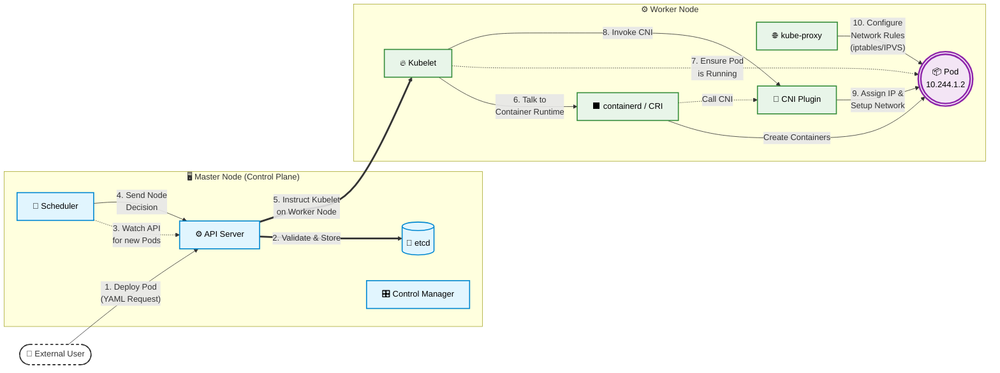
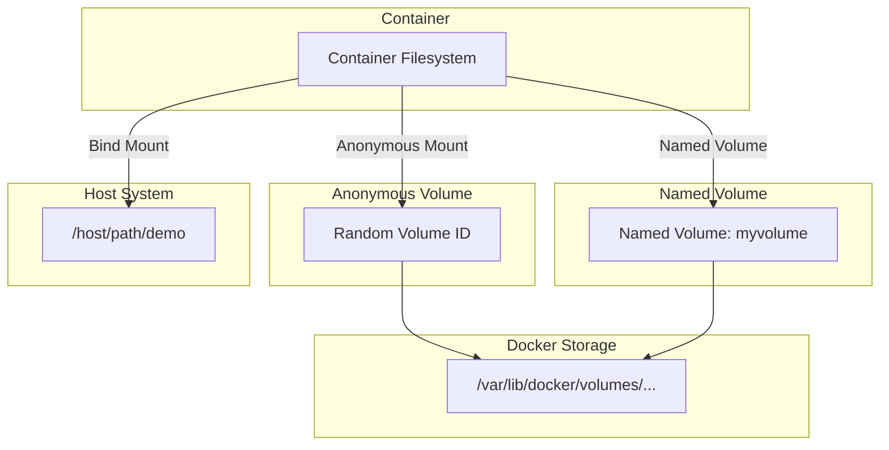

## Kubernetes Pod Creation & Networking Flow

```mermaid
flowchart LR
    %% Custom Styling for an "Illustrated" Look
    classDef userStyle fill:#ffffff,stroke:#333333,stroke-width:2px,stroke-dasharray: 5 5
    classDef masterStyle fill:#e1f5fe,stroke:#0288d1,stroke-width:2px,color:#000
    classDef workerStyle fill:#e8f5e9,stroke:#388e3c,stroke-width:2px,color:#000
    classDef podStyle fill:#f3e5f5,stroke:#8e24aa,stroke-width:3px,color:#000
    classDef bgMaster fill:#f0f4f8,stroke:#cbd5e1,stroke-width:2px,stroke-dasharray: 5 5
    classDef bgWorker fill:#f0fdf4,stroke:#bbf7d0,stroke-width:2px,stroke-dasharray: 5 5

    %% External Entity
    User([👤 External User]):::userStyle

    %% Master Node Subgraph
    subgraph Master["🖥️ Master Node (Control Plane)"]
        direction TB
        API[⚙️ API Server]:::masterStyle
        ETCD[(💾 etcd)]:::masterStyle
        Sched[📅 Scheduler]:::masterStyle
        CM[🎛️ Control Manager]:::masterStyle
    end

    %% Worker Node Subgraph
    subgraph Worker["⚙️ Worker Node"]
        direction TB
        Kubelet[🔥 Kubelet]:::workerStyle
        KProxy[🌐 kube-proxy]:::workerStyle
        CRI[⬛ containerd / CRI]:::workerStyle
        CNI[🔌 CNI Plugin]:::workerStyle
        Pod(((📦 Pod <br> 10.244.1.2))):::podStyle
    end

    %% Flow Steps (Master Node)
    User -- "1. Deploy Pod\n(YAML Request)" --> API
    API == "2. Validate & Store" ==> ETCD
    Sched -. "3. Watch API\nfor new Pods" .-> API
    Sched -- "4. Send Node\nDecision" --> API

    %% Cross-Node Instruction (Thick Line)
    API == "5. Instruct Kubelet\non Worker Node" ==> Kubelet

    %% Flow Steps (Worker Node)
    Kubelet -- "6. Talk to\nContainer Runtime" --> CRI
    CRI -- "Create Containers" --> Pod
    Kubelet -. "7. Ensure Pod\nis Running" .-> Pod
    
    Kubelet -- "8. Invoke CNI" --> CNI
    CRI -. "Call CNI" .-> CNI
    CNI -- "9. Assign IP &\nSetup Network" --> Pod
    
    KProxy -- "10. Configure\nNetwork Rules\n(iptables/IPVS)" --> Pod
```

    %% Apply background styles to subgraphs
    class Master bgMaster;
    class Worker bgWorker;

```mermaid
flowchart TB

    subgraph Container
        C1[Container Filesystem]
    end

    %% Anonymous Volume
    subgraph "Anonymous Volume"
        A1[Random Volume ID]
    end

    %% Named Volume
    subgraph "Named Volume"
        N1[Named Volume: myvolume]
    end

    %% Bind Mount
    subgraph "Host System"
        H1["/host/path/demo"]
    end

    %% Docker Storage
    subgraph "Docker Storage"
        D1["/var/lib/docker/volumes/..."]
    end

    %% Connections
    C1 -->|Anonymous Mount| A1
    A1 --> D1

    C1 -->|Named Volume| N1
    N1 --> D1

    C1 -->|Bind Mount| H1
```
